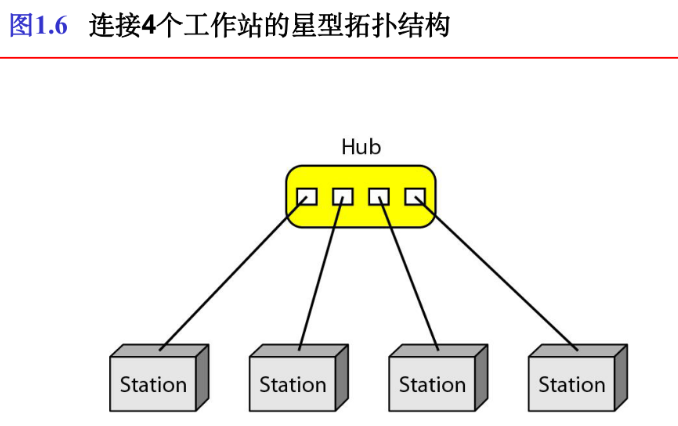

# 数据通信

[TOC]

电信（telecommunication）是指在一定距离上的通行；

数据（data）是指以任何格式表示的信息，该格式需要创建和使用数据的双方达成共识。

## 数据通信（data communication）

是在两台设备之间通过诸如线缆的某种形式的传输介质进行的数据交换。

数据通信的效率取决于四个关键要素：传递性、准确性、及时性、抖动性（到达时间和延迟各不相同）。

### 数据通信的五个组成部分

1.报文（message）:进行通行的信息（数据），他可以是文本、数字、图片、声音、视频等信息格式

2.发送方（sender）

3.接收方（receiver）

4.传输介质（transmission medium）:报文从发送方到接收方之间所经过的物理通路，他可以是双绞线、同轴电缆、光纤和无线电波

5.协议（protocol）:管理数据通信的一组规则，他表示通信设备之间的一组约定。

### 数据流

两台设备之间的通信可以是单工、半双工、或者全双工的。如下图所示：

##### 单工

在单工模式（simplex mode）下，通信是单方向的，如同在单行道上，两台设备只有一台能发送，另一台则只能接收。

##### 半双工

在半双工模式（half-duplex mode）下，每台主机均能发送和接收，但不能同时进行。当一台设备发送的时候，另一台设备就只能接收，反之亦然。

##### 全双工

在全双工模式（full-duplex mode）下，【也称双工】，双方主机均能同时发送和接收。

## 计算机网络

网络（network）是用通信链路连接起来的设备（通常称为节点）的集合。

大多数网络采用分布式处理，将任务划分给多台计算机，各自处理一小部分。

### 网络的三大准则

1.性能（performance）：吞吐量（throughput）、延迟（delay）等

2.可靠性（reliability）：故障出现的频率、一条链路从故障恢复的时间、在灾难中的健壮性

3.安全性（security）

### 链路（link）

链路是将数据由一台设备传输到另一台设备的通信通路。

点到点连接（point-point）

多点连接（multipoint connection）

### 物理拓扑结构（physical topology）

指的是网络物理上分分布的方式。

分为以下几种：

1.网状（Mesh）

全连接网状结构如下所示：

2.星型（star）

3.总线型（Bus）

4.环形（ring）

一般来说，在环状结构之中，信号始终是循环的。

5.混合型：

## 网络模型

计算机网络由许多实体组成，需要标准协调网络之间的通信。

最著名的两个标准是OSI模型（7层模型）和因特网模型（5层模型）。

**网络分类：网络分类取决于他的规模，主要包括局域网和广域网，以及介于两者之间的城域网。**

## 因特网的历史（略）

当两个或者多个网络彼此连接，他们称为互联网络（internetwork），即互联网（internet），最为著名的互联网称为因特网（Internet）。

# 协议和标准

## 网络协议（Protocal）

为计算机网络中进行数据交换而建立的规则、标准或约定的集合。

由以下三个要素组成：

(1)语义(Semantics)。涉及用于协调与差错处理的控制信息。用于解释比特流的每一部分的意义;

(2)语法(Syntax)。涉及数据及控制信息的格式、编码及信号电平等。

(3)时序(Timing)。涉及速度匹配和排序等。事件实现顺序的详细说明

