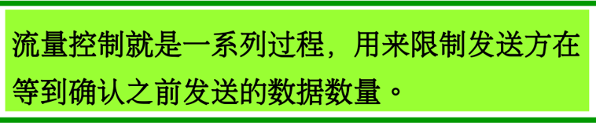
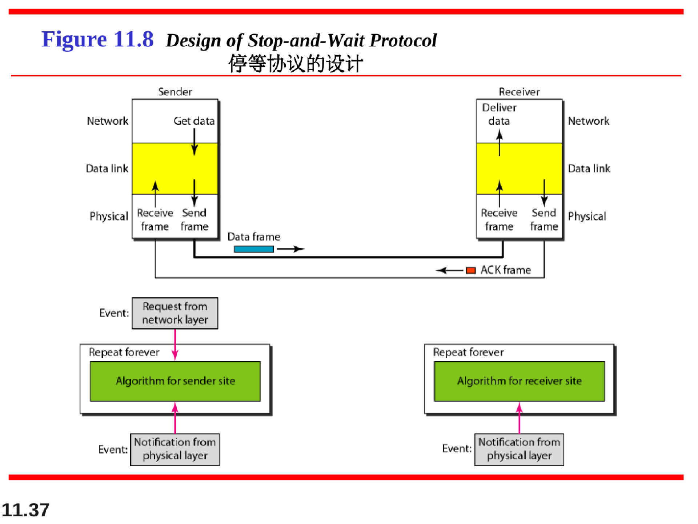
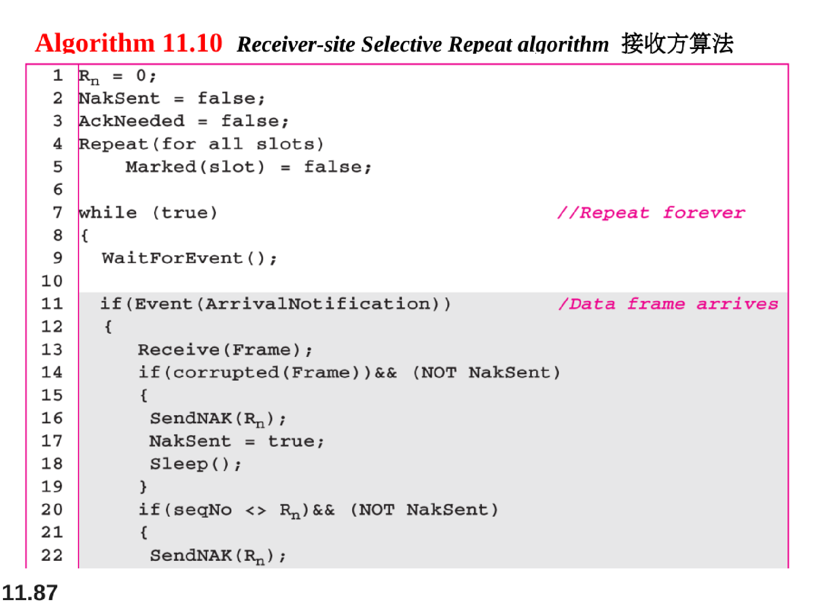
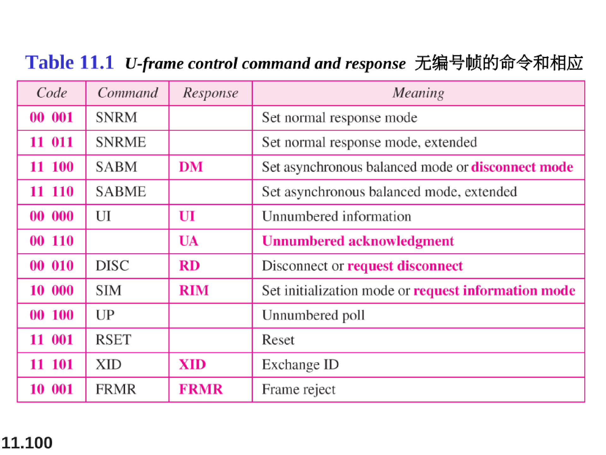
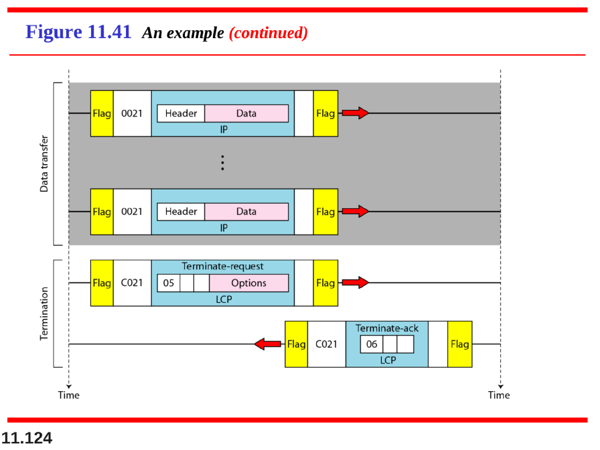

# 数据链路控制（Data Link Control）

数据链路层的两个主要功能是：

1. 数据链路控制，用来处理两个相邻节点之间的通信；介质访问控制，如何共享媒介进行访问控制
2. 数据链路控制的功能包括成帧，流量控制和差错控制。

本章主要介绍5个链路控制协议，两个用于无噪声信道，三个用于有噪声信道

## 数据链路层

数据链路层的基本概念：

数据链路层像个数字管道

而在这条数字管道上传输的数据单位是帧。

早期的数据通信协议曾叫做通信规程（procedure）。

因此在数据链路层，规程和协议是同义语。

## 成帧（Framing）

数据链路层需要将一组比特位组成帧，以便帧和帧之间是可以识别的。邮局系统就实现了成帧方式，信封就是一种分隔符。

分为固定长度成帧（如ATM信元）和可变长度成帧（面向字符和面向比特位）。

可变长度成帧在帧开始和结束的地方各添加一个Flag标识符，来标定一个帧。

为了防止Flag在数据部分出现导致的错误，以下两种方式（字节填充与比特位填充）用于避免

### 面向字符的帧

### 面向比特位的帧

## 流量控制和差错控制（Flow  and Error Control）

数据链路层最重要的功能就是流量控制和差错控制。通常一起成为数据链路控制。

### 流量控制

### 差错控制

## 几种协议（Protocols）

## 无噪声信道（Noiseless channels）

首先，假设有一种不会丢失帧、复制帧或损坏帧的理想信道。

包括两种协议：

1. 无流量控制（最简单的协议）
2. 有流量控制，但无差错控制（停等协议）

### Simplest Protocol最简单的协议

### Stop-and-Wait停等协议

此时协议仍然很简单，发送方发送一帧后要等待接收方的ACK帧的反馈确认，才能发送下一帧。

## Noisy Channels有噪声信道

尽管停等协议增加了流量控制的概念，但无噪声信道仅是理想的，不存在的。需要讨论三个使用差错控制的链路协议。

### Stop-and-Wait Automatic Repeat Request 停等ARQ

### Go-Back-N ARQ回退N帧协议

发送窗口：

Sf是发送窗口的目前所在的第一位（未收到ACK确认的第一位），Sn是下一个准备发送的帧。

Ssize是滑动窗口的长度

接收窗口：

如果中途某个帧丢失了，没能反馈回ACK时，发送方会继续发送滑动窗口后续的帧，直到丢失的那一个帧的定时器到时了，使发送方开始重传

## Selective Repeat ARQ 选择性重传ARQ

## HDLC高级数据链路控制协议

High-level Data Link Control(HDLC)是一个实际应用的面向比特的数据链路协议，支持点到点链路和多点链路。

具体实现了本章讨论的各种ARQ协议

这个FLAG就是本章之前介绍的面向比特的帧格式

在计算机网络的数据链路层中，特别是在HDLC（高级数据链路控制）协议中，控制字段中的P/F位是一个重要的组成部分。P/F位，即Poll/Final位，用于流量控制和链路管理。具体来说：

1. **轮询（Poll）**：当P/F位作为命令帧（如S帧或I帧）的一部分发送时，它表示轮询。这意味着发送方在询问接收方是否有数据要发送。如果P位被设置为1，接收方必须立即给出响应。

2. **终止（Final）**：当P/F位作为响应帧的一部分发送时，它表示终止。这通常意味着发送方已经完成了数据的发送，并期望接收方确认这一点。

在HDLC协议中，P/F位的使用增加了通信的灵活性。例如，在全双工通信中，任何一方都可以设置P位为1，要求对方立即响应，这样可以更早地收到对方的确认。如果不使用P/F位，接收方可能不会立即发送确认帧，而是在发送自己的信息帧时，通过N(R)捎带发送确认信息。

总结来说，P/F位在HDLC控制字段中扮演着重要的角色，用于实现轮询和终止的功能，以确保数据传输的可靠性和效率。

## Point-To-Point Protocol点到点协议

PPP协议是最常用的一种点到点链路协议，使用面向字节的方式

此处的帧格式是本章前面介绍的面向字节的帧格式

当PPP协议用于面向比特的同步链路时：

PPP协议的定位：

