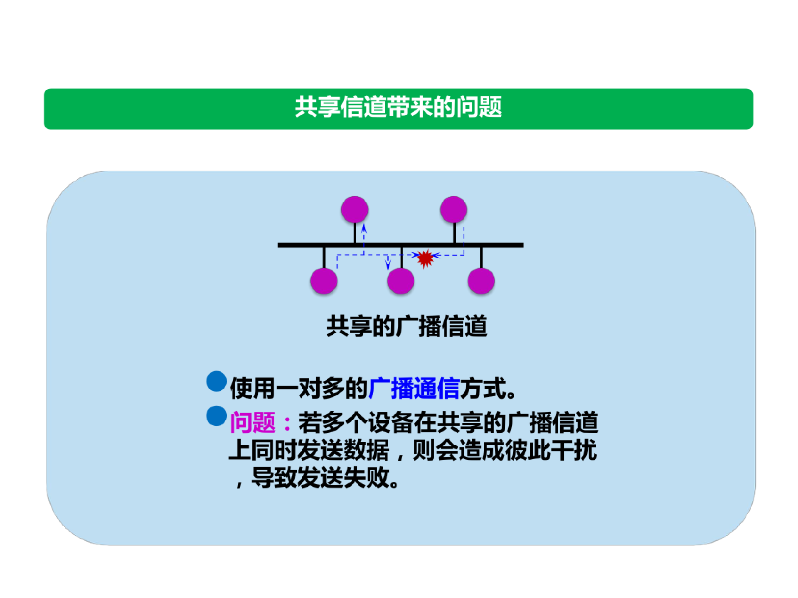
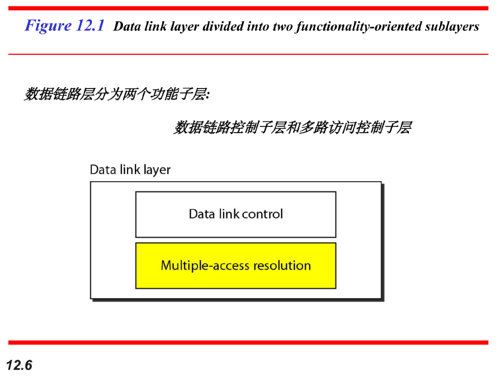
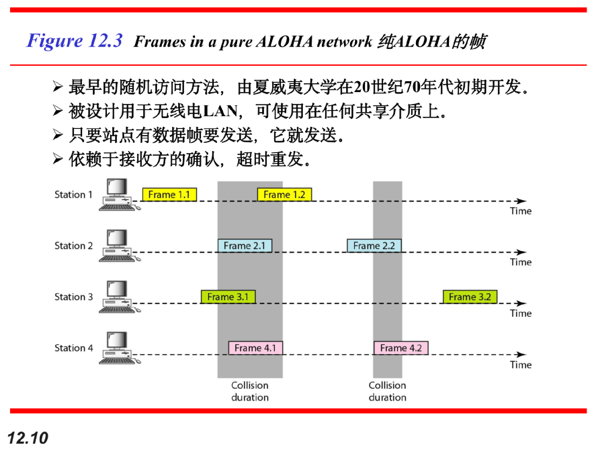
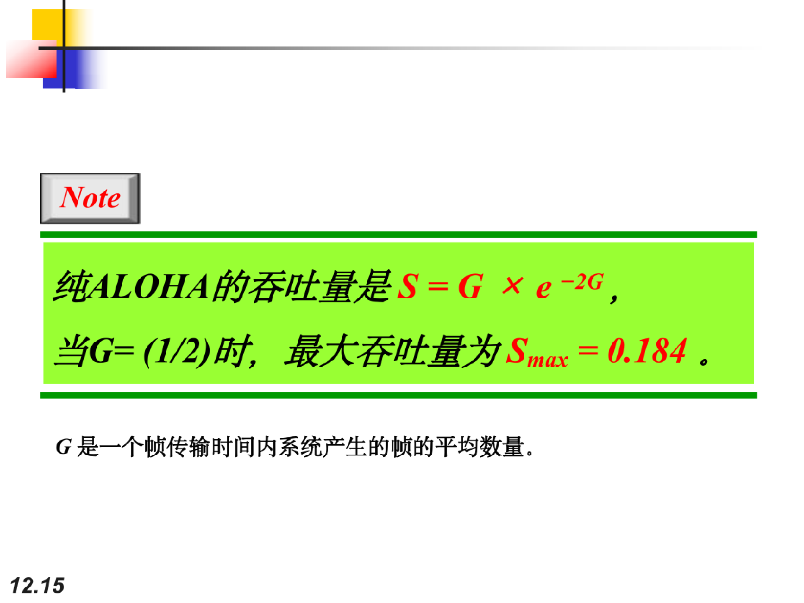
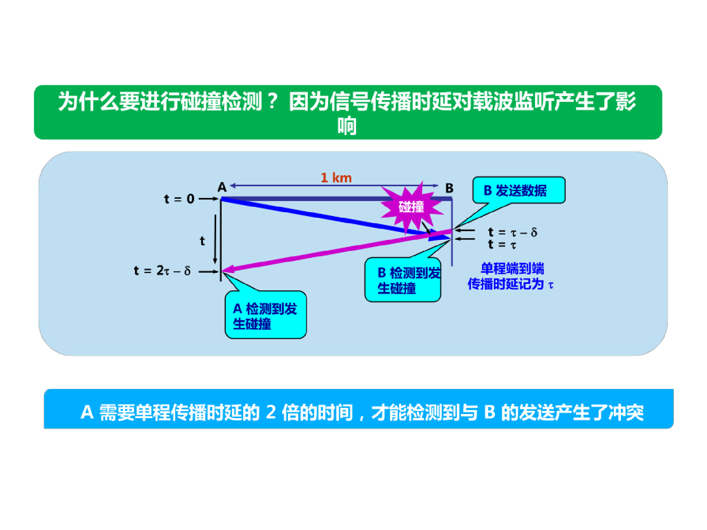
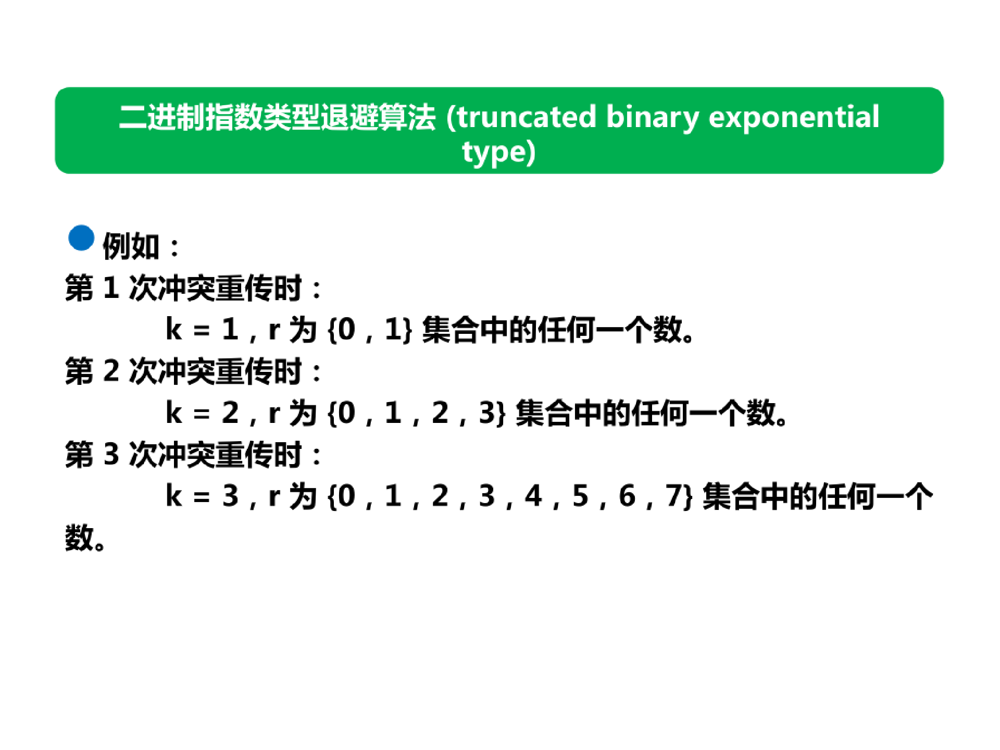

# 多路访问

## 局域网的数据链路层

局域网最主要的特点是：

1. 网络为一个单位所拥有；
2. 地理范围和站点数量均有限。

局域网有如下优点：

1. 具有广播功能，从一个站点可很方便地访问全网。局域网上的主机可共享连接在局域网上的各种硬件和软件资源。
2. 便于系统的扩展和逐渐地漠边，哥设备的位置可灵活调整和改变。
3. 提高了系统的可靠性、可用性和残存性。

## Random Access随机访问协议

在随机访问或竞争访问方式中，没有一个站点是优于其他站点的，也不能控制其他站点。

没有站点有权利允许或不允许其他站点发送或不发送数据。

有数据要发送的站通过自身的协议决定发送还是不发送数据。

### 随机访问

### pure ALOHA  纯ALOHA

### 时隙ALOHA

### CSMA/CD协议

##### CSMA/CD 协议 与 CSMA/CA 协议 不同点 :

① 传输介质不同 :

无线网 : CSMA/CA 协议 用于 无线局域网中 ;

有线网 : CSMA/CD 协议 用于 总线型 以太网 中 ;

② 监听方式不同 :

CSMA/CD 协议 监听 有线信道 中的电压变化 ;
CSMA/CA 协议 采用 能量检测 ( ED ) , 载波检测 ( CS ) , 能量载波混合检测 , 三种方式检测信道是否空闲 ;
③ 对于冲突的处理 :

CSMA/CD 协议 检测冲突 ;

CSMA/CA 协议 避免冲突 ;

##### 争用期

当帧发生碰撞后会向其发送站点返回碰撞信号，设该帧发送时间为t，则检测到碰撞信号的时间为2t，则在整个信道上，取该时间的最大值为2T为争用期。**T为单程端对端的传播时延。**

##### 截断二进制指数

当发生碰撞时立即停止发送帧。隔一段时间后重新发送。那么需要隔多长时间呢？

退避时间 = 争用期（2t）* 随机次数r

##### 人为干扰信号

​	①定义
人为生成的信号：由设备故意发送的、不包含有效数据的信号。

②特征

由设备主动发出：设备在特定情况下（如检测到碰撞后）主动发送的，不是数据传输过程中的正常信号。发送设备故意制造这个信号来传递特定信息（如告知发生碰撞），而不是用于数据传输。
不包含有效数据：通常是一些特定的比特序列，可能是随机的，也可能是预定的固定模式，但并不包含任何有意义的数据信息。
目的明确：例如，在CSMA/CD协议中，**干扰信号（jamming signal）**就是一种人为生成的信号。在检测到碰撞后，发送设备会故意生成一段32或48比特的随机比特流，并发送到信道上。确保其他设备检测到碰撞，避免继续发送数据。
与随机噪声或环境干扰不同：随机噪声或环境干扰是非人为的，通常不可控，可能是由电磁干扰、线路问题等引起的。而人为生成的信号是设备根据协议主动制造的干扰，具有特定的格式和作用。
③作用

冲突通知：干扰信号是一种人为的信号干扰，确保其他站点能够检测到发生碰撞，以便采取避让措施。
信道清理：在发送干扰信号后，信道处于空闲状态，各站点会随机等待一段时间（根据截断二进制指数退避算法）后再尝试发送，避免再次冲突。
④示例
当发送站检测到碰撞后，会立即停止数据传输，并发送32或48比特的人为干扰信号（jamming signal）以确保其他站点识别到碰撞。同时，以太网规定帧间最小间隔为9.6 μs，以确保各站点有充足的时间准备下一次传输。

### CSMA/CA

帧间间隔IFS

## Controlled Access 受控访问协议

在受控访问协议中，站点之间相互协商以确定哪一个站有权发送。没有得到授权的站点无权发送数据。

主要分为以下三种受控访问协议：

### Reservation access method预约访问协议

### Polling轮询

### Token Passig令牌传递

## Channelization通道化

通道化也是一种多路访问方法。不同站点之间在时间域上、频率域上、或码域上正交化来共享信道。

主要包括下面三种方式：

### Frequency-division multiple access（FDMA）频分多址

### Time-division multiple access(TDMA)时分多址

### code-division multiple access(CDMA)码分多路访问

