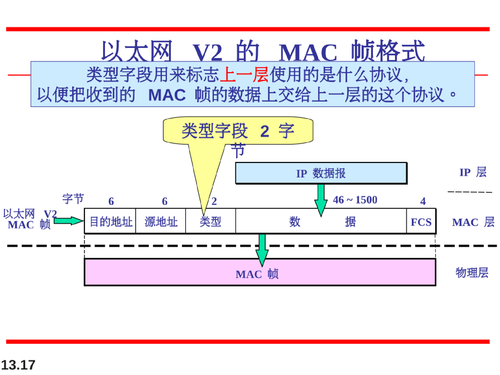
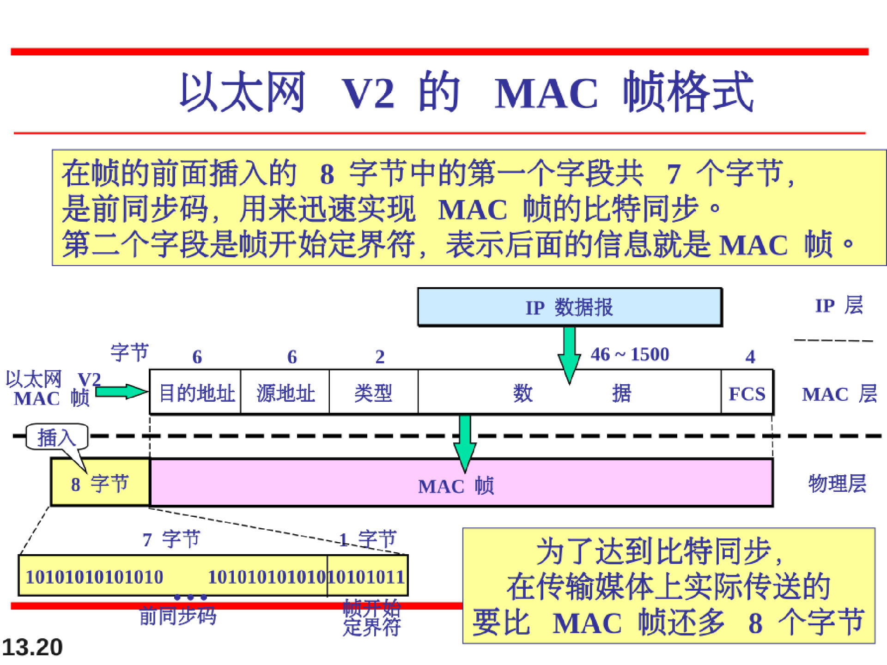

# 有线局域网-以太网

##  IEEE

IEEE中，数据链路层被分出了一个LLC子层（逻辑链路控制层）和一个MAC子层

## 标准以太网

最初的以太网是由施乐公司的Palo Alto研究中心（PAPC）创建的。自此之后，它经历了四代的发展。我们将简单介绍标准（或传统）以太网。具体包括MAC子层和物理层相关信息。

数据链路层在IEEE802标准中被分为两个子层：LLC子层和MAC子层

LLC子层与传输媒体无关，不管采用任何协议的局域网对LLC子层来说都是透明的。

在IEEE802中，流量控制、差错控制和部分成帧的功能集中到LLC子层中。

而MAC子层为不同的局域网提供不同的协议。

#### 802.3的mac帧格式：

1. Preamble前导码：7个字节共56位，其中0和1交替出现，以通知接受系统有帧的到来并使其与输入的时钟同步。实际上，前导码是在物理层上加入进去的，并不是帧的一个部分。
2. 起始帧分解符（SFD）：第二个字段，1个字节，10101011，说明（通知）帧的开始。
3. 目的地址（DA）：六个字节，物理地址
4. 源地址（SA）：六个字节，物理地址
5. 长度或类型：2个字节，协议数据单元PDU。最初的以太网用这个字段作为类型字段来定义使用MAC帧的上层协议。IEEE标准使用它作为长度字段来定义数据字段的字节数。在今天两种都被普遍使用。
6. 数据：由上一层协议封装好的数据。最少是46字节，最大是1500字节。
7. CRC循环校验码：在此情况下是CRC-32。4个字节。

除去数据字段的控制字段占的长度为：18字节（6字节的目的地址，6字节的源地址，2字节的PDU长度\类型【协议数据单元PDU】，4字节的CRC循环校验码）

最小长度是因为在CSMA的协议中（实际因为在往返最大传播时延中能传播的帧长）低于64字节的帧长视为无效帧长。所以最小的数据段长度为：64-18=46字节

最大长度是因为设定数据段的最长长度为1500字节，故整个帧长为1500+18=1518字节

下图，上面的是802.3，下面的是以太网V2的格式

#### 无效的MAC帧类型

## MAC地址

##### **MAC目的地址单播多播广播的判定**

## 标准以太网物理层的实现

曼彻斯特编码：

### 10base5：粗缆以太网

总线型

### 10Base2：细缆以太网

总线型

### 10Base-T：双绞线以太网

星型、UTP

### 10Bse-F：光纤以太网

星型、fiber

## 标准的变化

### 桥接以太网

### 交换式以太网

### 全双工交换式以太网

## 快速以太网

## 千兆以太网

