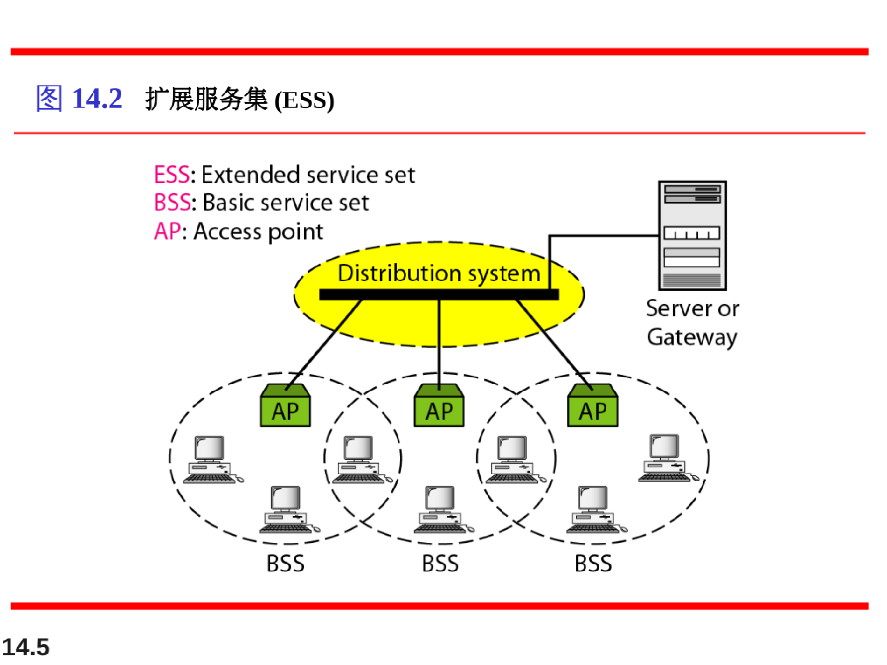
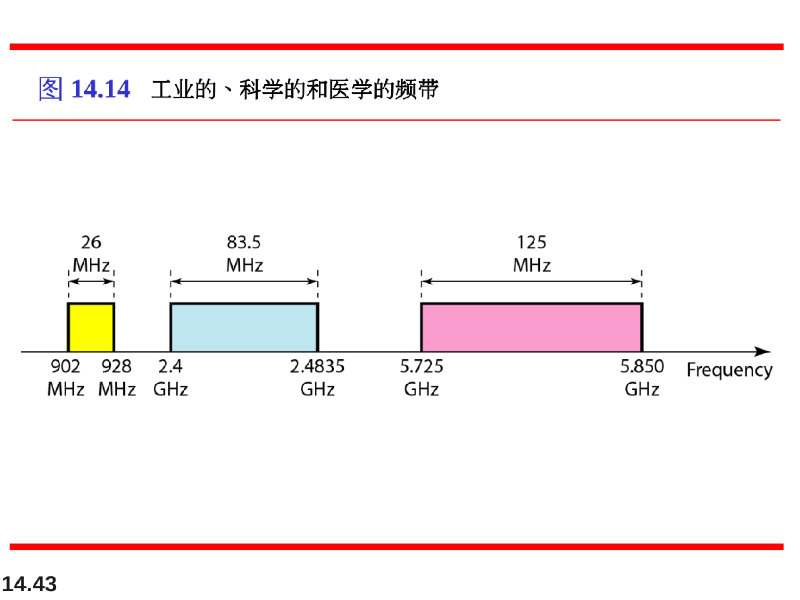

# 无线局域网

由IEEE定义的无线局域网规范称为IEEE802.11，该规范涵盖了物理层和数据链路层。

BSS：基本服务集（无线局域网的积木块）

AP：接入点（中央基站）

## IEEE802.11标准中的MAC层

802.11的MAC层在物理层之上包括两个子层：

## MAC帧格式

1. FC：帧控制。定义了帧的类型和一些控制信息。2字节。内容包括：协议版本、类型、子类型、To DS、From DS、更多标记、重传（置1表示为重传帧）、Pwr mgt、更多数据、WEP、Rsvd
2. D：2字节。在一个控制帧中，这个字段用来定义帧的ID；其他类型的帧中，这个字段用来定义用于设置NAV值的传输间隔时间。
3. Address地址：四个地址，每个占6字节。每一个地址字段的含义取决于To DS和From DS子字段的值
4. SC序列控制：2字节。定义帧的序列号，以用于流量控制
5. Frame Body帧主体：长度可以在0~2312字节之间。包含了根据FC字段中定义的类型和子类型的信息。
6. FCS：4字节。CRC-32差错检测序列。

From DS和To DS 这两个字段反映了是否来自或是发送到分布式系统。为0表示不是分布式系统。

根据这两个字段会改变四个地址字段的值。

**总结：地址1总是下一个设备的地址，而地址2总是前一个设备的地址。如果最后的目的站点没有被地址1定义的话，地址3就是最后目的站点的地址。如果起始源站点的地址与地址2不同的话，那么地址4就是起始源站点的地址。如果都来源于同一个BSS，那么地址3字段写入所在BSS的ID。**

## 站点隐藏与暴露问题

