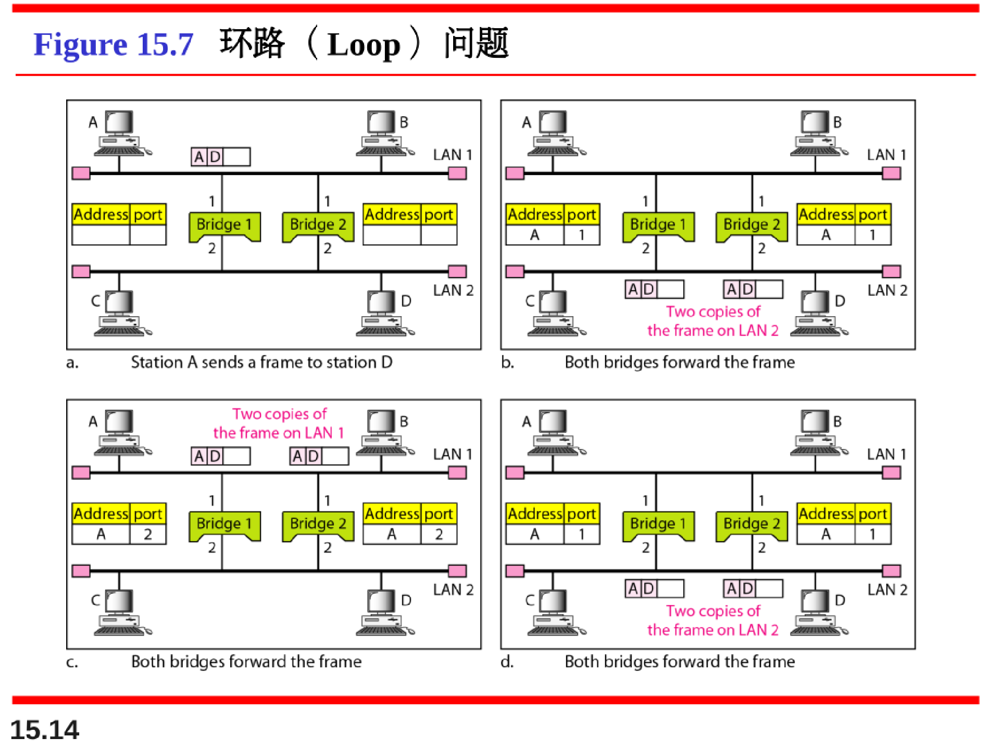

# 连接局域网、主干网和虚拟局域网

## 连接设备

根据连接设备在网络中工作的层次，将连接设备分为五类：

1. 无源集线器 Passive Hubs
2. 有源集线器 Active Hubs 或 中继器 Repeater
3. 网桥 Bridges 或 二层交换机 Two-Layer Switches
4. 路由器 Routers 或 三层交换机 Three-Layer Switches
5. 网关 Gateways

### 中继器

### 网桥

出现换路问题会导致链路中出现多个帧的复制：

### 连接独立LAN和WAN的路由器

## 主干网

主干网允许连接多个局域网。

在主干网中，站点不直接连接到主干上。

站点是局域网的一部分，由主干来连接这些局域网。

### 总线型主干网 Bus Backbone

### 星型主干网 Star Backbone

### 连接远程LAN Connecting Remote LAN

## 虚拟局域网（virtual local area network，VLAN）

可以像局域网一样概略的定义虚拟局域网，通过软件，而不是通过物理线路来配置。

### **虚拟局域网使用的以太网帧格式**

即普通的有线以太帧的基础上，加入四个字节的VLAN信息

