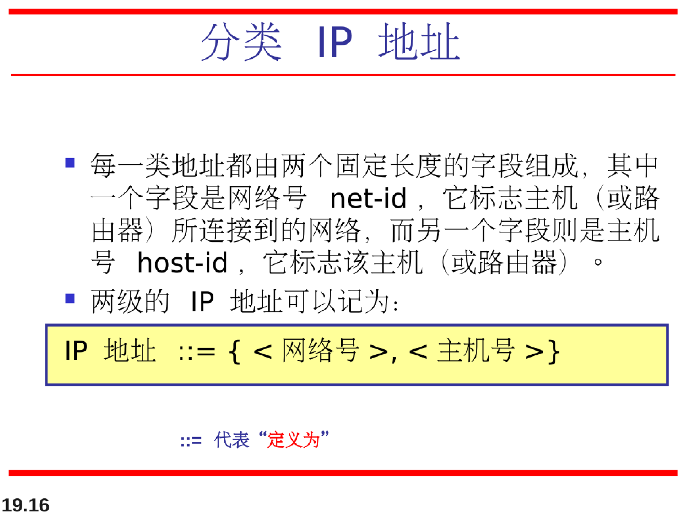

# 网络层：逻辑寻址

## IPV4地址

ipv4地址是一个32-bit地址，它唯一地与通用地定义了一个链接子啊因特网上的设备（例如，主机或是路由器）。

**ipv4地址是32位长！**

ipv4地址是唯一的和通用的。

### 分类寻址

### 无类寻址

注意，专用网络地址：

### NAT转发专用地址

## IPV6地址

因特网地址耗尽是长期存在的问题。

这个问题与其他IP协议本身的问题一起，促使IPV6的提出。

**一个IPV6地址长度是128位。**

