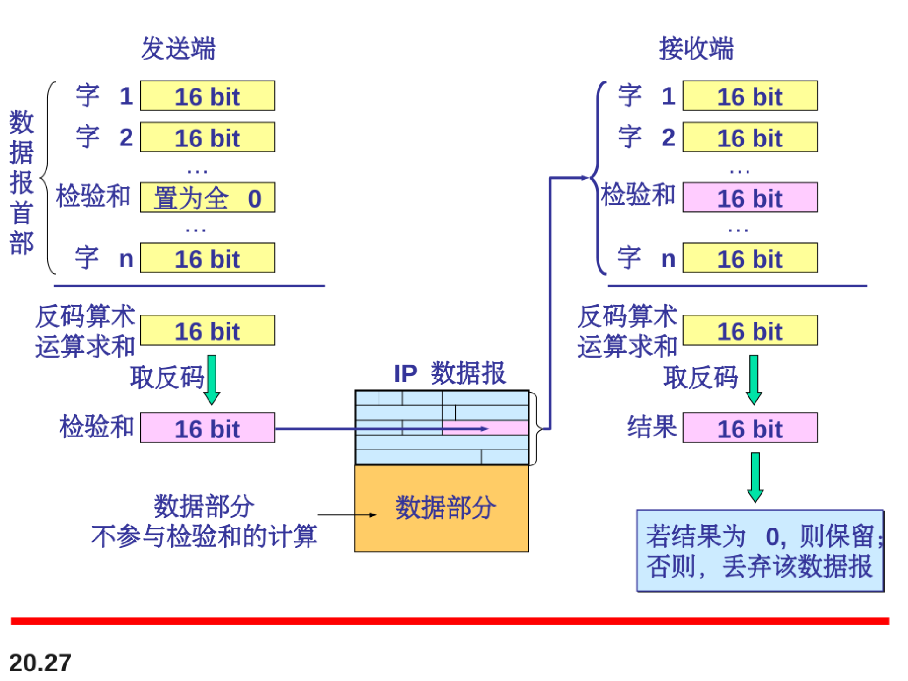

# 网络层：IP协议

## 网际互联

网际互联和网络连接来实现互联网或者因特网。

 

**因特网中的网络层交换是利用数据报分组交换的方式实现的。**

##### **因特网的网络层通信是无连接的**

## IPv4

网际协议第四版（IPv4）是TCP/IP协议使用的传输机制。

各字段解释：

1. 版本（ver）：占4bit，指IPv4的版本，目前的IP协议版本号为4（即IPv4）

2. 首部长度（HLEN）：占4bit，可表示的最大数值是15个单位（一个单位为4字节）。因此IP的首部长度的最大值是60字节。

3. 服务类型：占8bit，用来获得更好的服务、这个字段以前一直没有被人们使用。

4. 总长度：占16bit，指首部和数据之和的长度，单位为字节，因此数据报的最大长度为65535字节。总长度必须不超过最大传送单元MTU。

5. 标识（identification）：占16bit，它是一个计数器，用来产生数据报的标识。

6. 标志（flags）：占3bit。

   第一位：0--未使用。现在必须为0

   第二位：1--指示是否可以进行分片：0表示可以分片，1表示不能分片

   第三位：2--包被分片的情况下，表示是否为最后一个包：0表示是最后一个分片的包，1表示是分片中段的包。

7. 片偏移：13bit，指出较长的分组在分片后这一片在原分组之中的相对位置。片偏移以8个字节为偏移单位。

8. 生存时间(Time To Live, TTL)：8bit，数据报在网络中的寿命，其单位为秒。（存疑：可跳转的条数？）

9. 协议：8bit，指出此数据报携带的数据使用何种协议以便目的主机的IP层将数据部分上交给哪个处理过程。

10. 首部校验和：16bit，只检验数据报的首部，不包括数据部分。不使用CRC，而仅仅使用简单的校验和。

11. 源地址和目的地址都各占4字节。

### 片偏移字段：

### 协议：

### 首部校验和：

### 服务类型：

服务类型字段8个bit中的四个比特位标注了五种需要的服务类型

包括：默认的正常服务、最小cost、最大可信度、最大吞吐量、最小的延迟

对于不同的报文和传输目的，可以请求不同的服务方式（类型）

### 总长度

### 协议字段

### 	示例：

注意0x0028是十六进制

## 最大传输单元（MTU）

### 标记字段

## IPv6

TCP/IP协议族中的网络层协议现在是IPv4。虽然IPv4设计的很好，但是。。。。。。

1. 版本（version）：4位，指明协议版本，IPv6为6
2. 通信量类(traffic class)-一8位·这是为了区分不同的IPv6数据报的类别或优先级·目前正在进行不同的通信量类性能的实验·
3. 流标号(flow label)——20位。“流”是互联网络上从特定源点到特定终点的一系列数据报，“流”所经过的路径上的路由器都保证指明的服务质量。所有属于同一个流的数据报都具有同样的流标号。
4. 有效载荷长度(payload length)-一 16 位·它指明IPv6数据报除基本首部以外的字节数(所有扩展首部都算在有效载荷之内)，其最大值是64kb 。
5. 下一个首部(next header)一-8位·它相当于IPv4的协议字段或可选字段。
6. 跳数限制(hop limit)—一8位·源站在数据报发出时即设定跳数限制·路由器在转发数据报时将跳数限制字段中的值减1 ·当跳数限制的值为零时，就要将此数据报丢弃·
7. 源地址一128 位·是数据报的发送站的IP地址。
8. 目的地址一一128位·是数据报的接收站的IP地址·

## IPv4到IPv6的过渡

