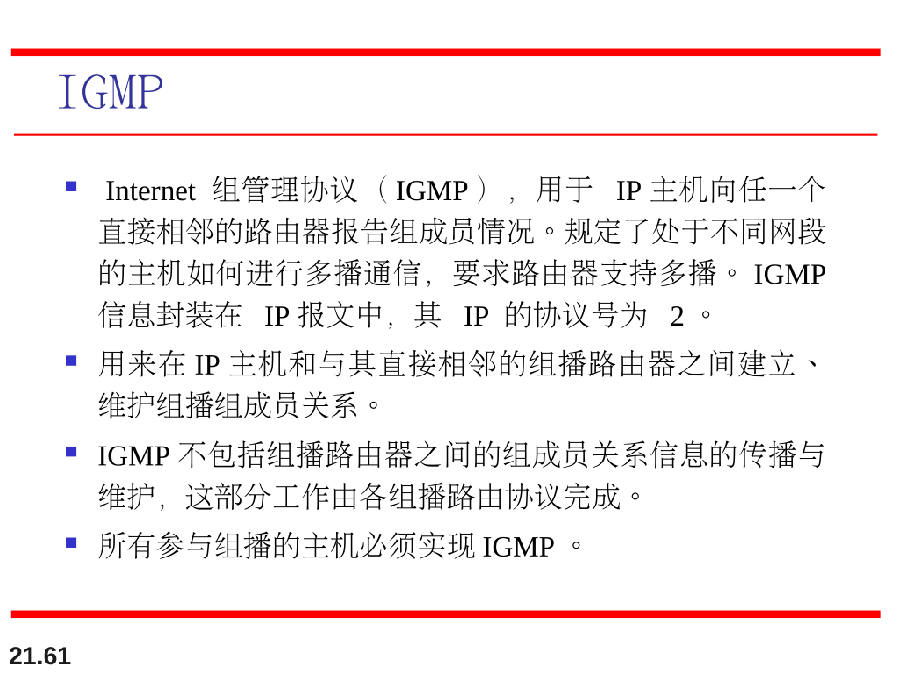
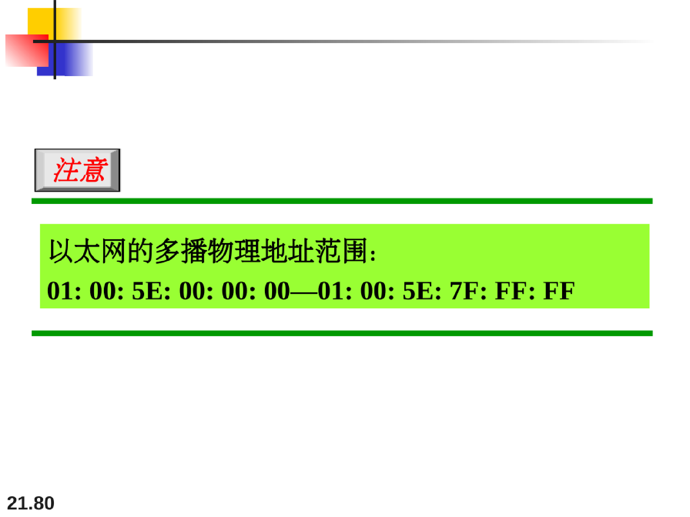

# 地址映射，差错控制和多播

## 地址映射

将分组传递到主机或路由器需要两级地址：逻辑地址和物理地址。

需要将一个逻辑地址映射成为它对应的物理地址，反过来也一样。

可以通过静态或动态映射完成。

## ARP操作（地址解析协议）

ARP：IP地址到硬件地址的映射

如果ARP高速缓存中没有存目标主机的mac映射，就在局域网内广播发送ARP请求分组，同时在请求中附上自己的IP与硬件映射。接收到ARP请求分组的目标主机返回一个ARP响应分组。

需要注意的是ARP请求是在局域网范围内的。

## RARP逆地址解析协议

逆地址解析协议RARP使只知道自己硬件地址的主机能够知道其IP地址。

这种主机往往是无盘工作站。因此RARP协议目前已很少使用

## ARP分组报文格式

eg：

#### 代理ARP

#### RARP与BOOTP

## DHCP

DHCP提供可以是人工的或自动的静态或动态的地址配置。

首先静态查找，其次动态分配。

DHCP在有限的期间内提供临时IP地址。

租用期到时，停止使用该IP或更新其租用。

## ICMP

**因特网控制报文协议（ICMP）就是为了弥补IP协议没有差错报告或差错纠正机制，也缺少一种为主机或管理查询的机制这两个缺点设计的，它是配合IP协议使用的。**

### ICMP报文的格式

注意：ICMP总是向原始的源方报告差错报文。

注意，以下几种情况不会产生ICMP差错报文：

## Ping命令【应用层直接使用网络层ICMP的例子】

## IGMP

IP协议可用到两种类型的通信∶单播和多播。

因特网组管理协议(Internet Group ManagementProtocol，IGMP)是其中一个必要的﹐但不是充分的协议（正如我们将会看到)，多播也包含其他的协议。在IP协议中，IGMP是一个辅助协议。

### IGMP报文格式

### IGMP分组

eg：

### 隧道技术

## ICMPv6

