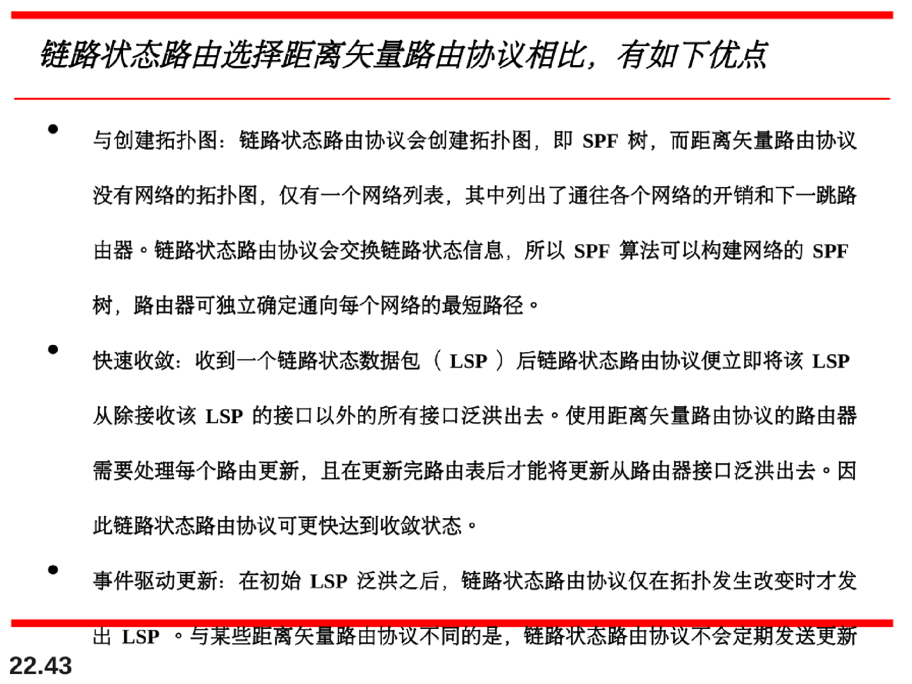
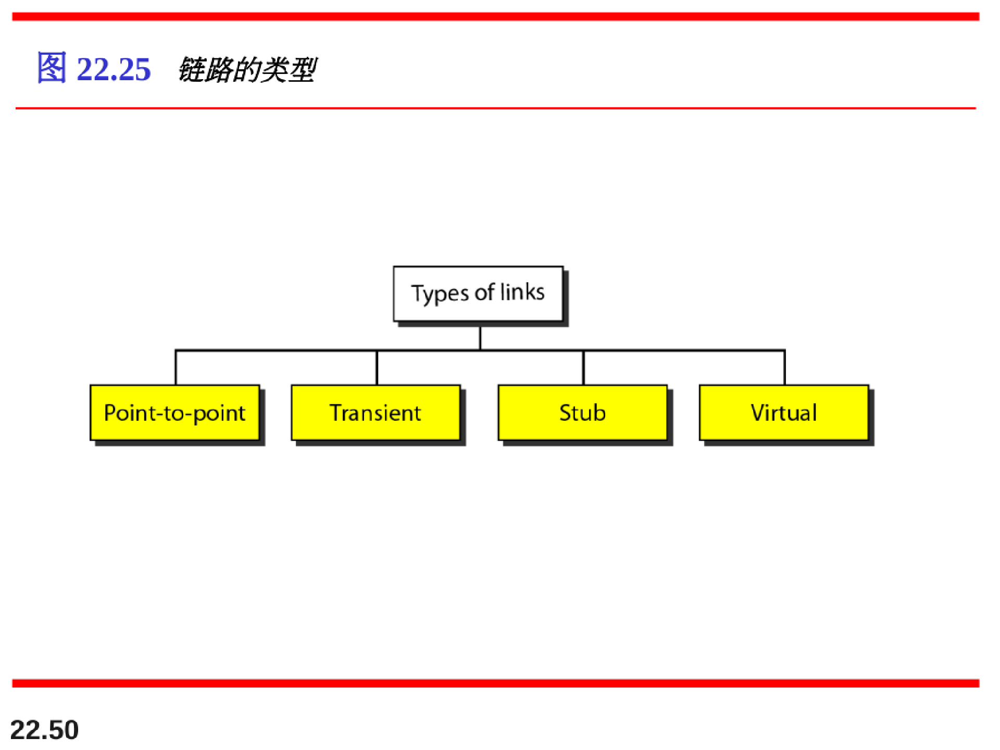
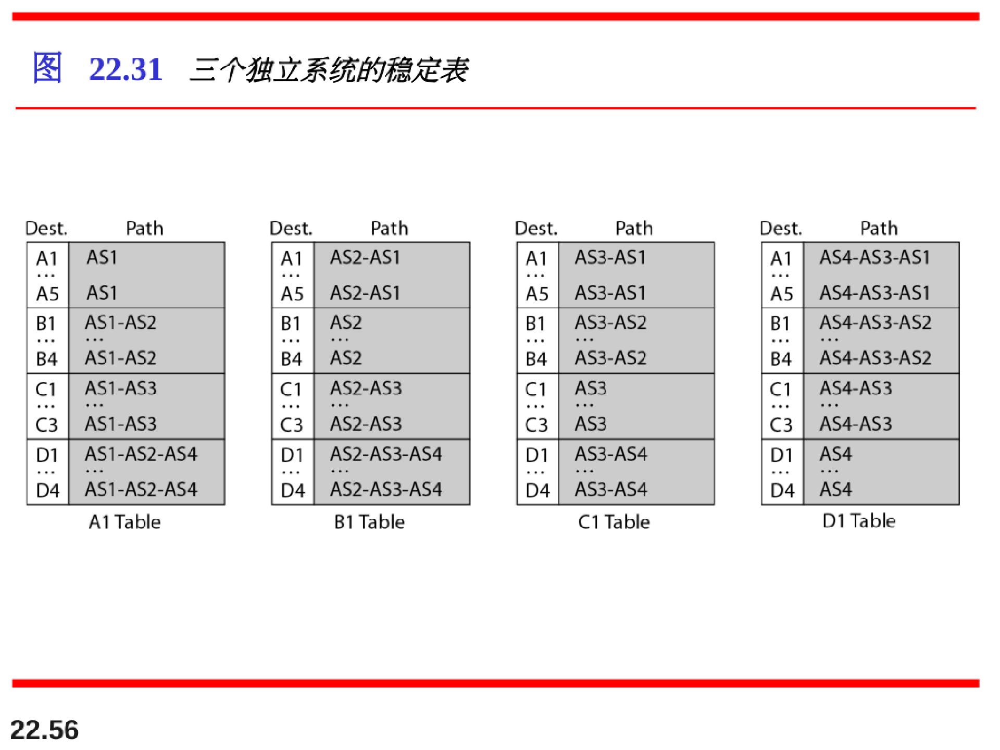
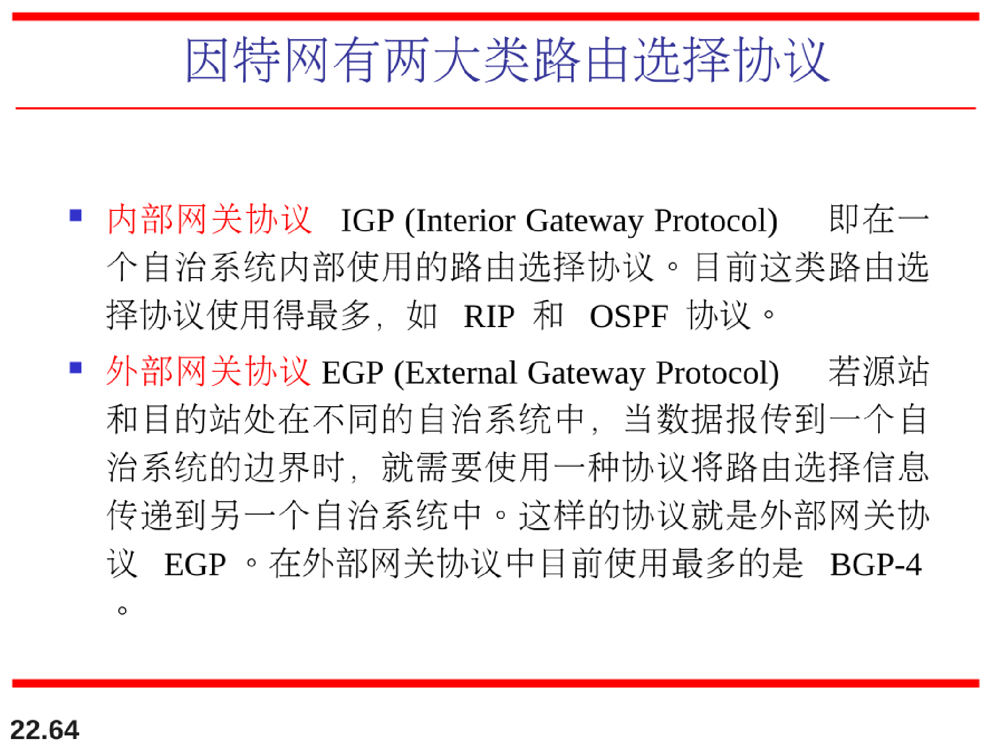
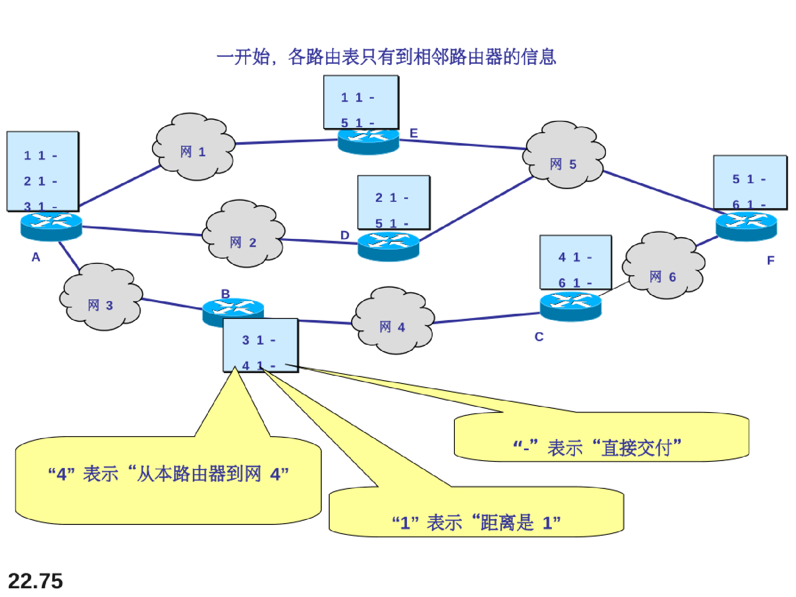
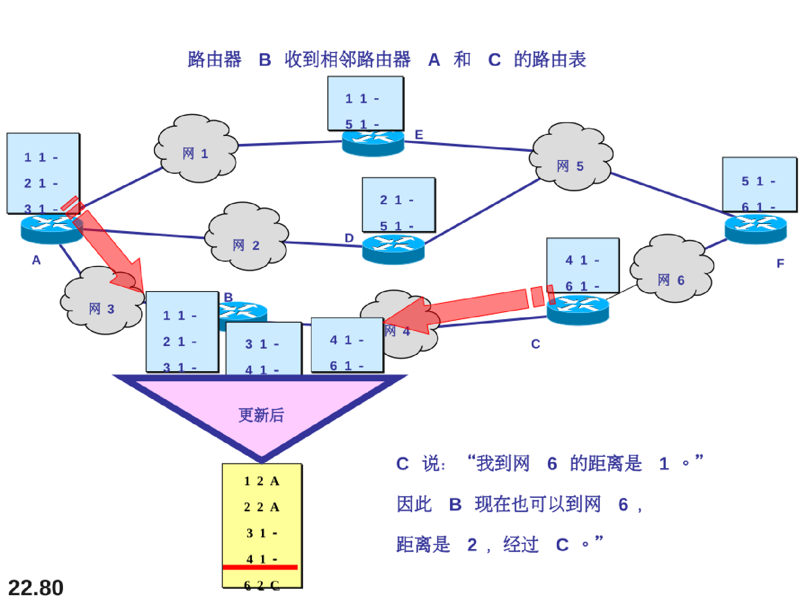
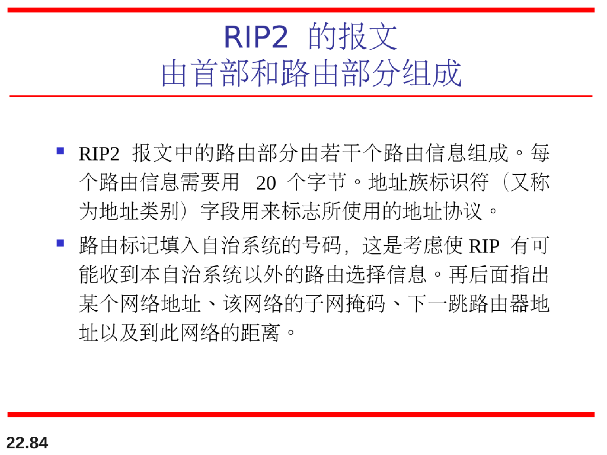
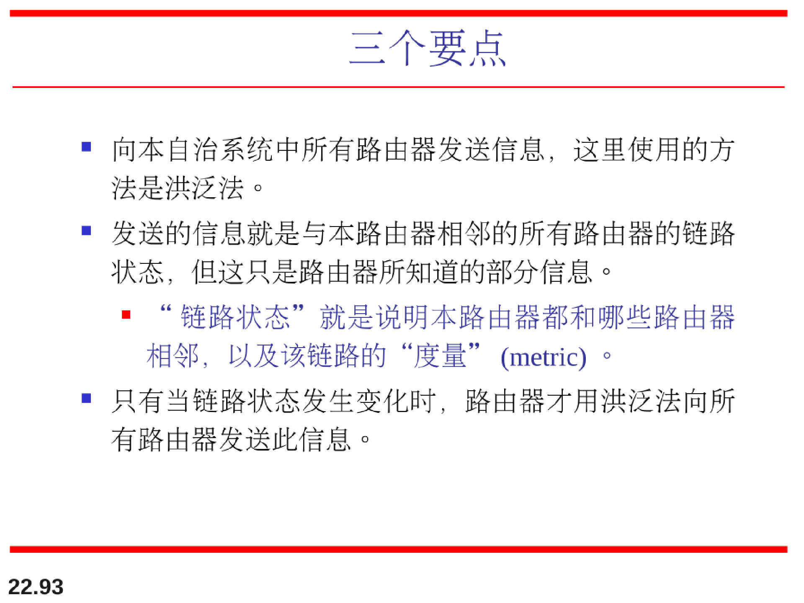
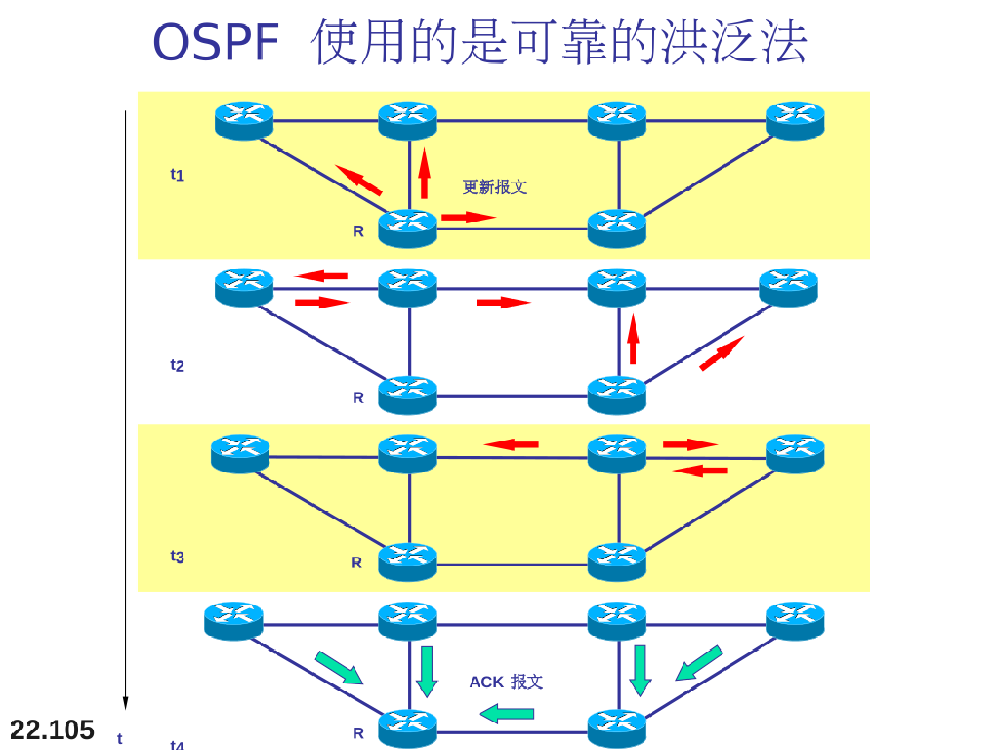
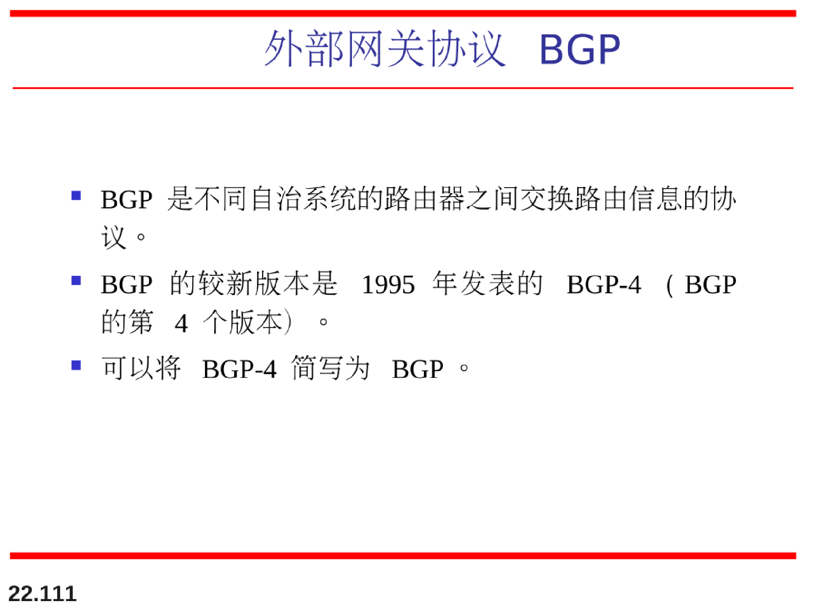

# 传递、转发和路由选择

>传递( Delivery )，在网络层控制下，用底层的网络对一个分组进行处理。
>
>转发( Forwarding) ，一个分组传递到下一站点的方法。
>
>路由选择（Routing)，在转发过程中创建路由表的方法。

## 传递

网络层负责用底层物理网络处理分组，我们定义这种处理为分组的传递。

### 直接传递和间接传递

## 转发

转发是指将分组路由到它的目的端。

转发要求主机或路由器有一个路由表。

当主机有分组要发送时，或路由器已收到一个分组要转发时，就要查找路由表以便求得到达最终目的端的路由。

## 单播路由选择协议

### 自治系统AS

### 距离向量路由选择表

坏消息传递慢

### RIP协议

用跳数来衡量距离

使用广播UDP报文来交换路由信息！

最大距离为15跳，16跳就视为不可达

### 链路状态路由选择（最短路径优先协议）

基于Dijkstra最短路径优先（SPF）算法

### 链路类型

### RIP

### RIP报文

坏消息传播慢

### OSPF

open-SPF

使用dijkstra最短路径算法SPF

### OSPF报文

### 外部网关协议BGP

### BGP报文

## 多播路由选择协议

