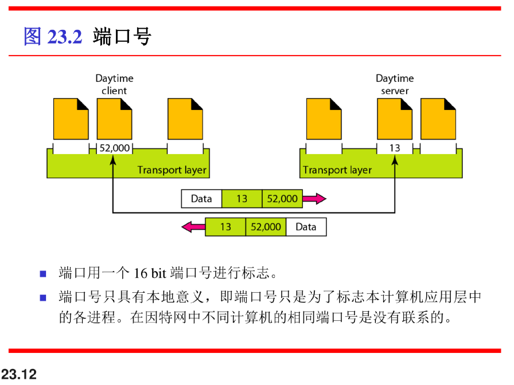
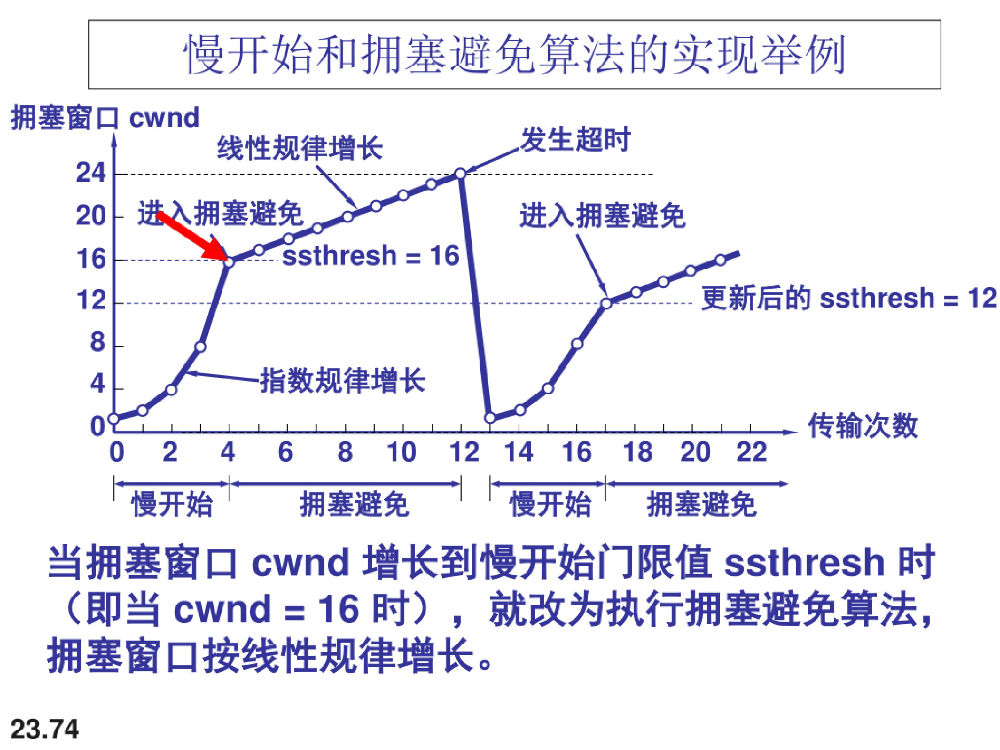

# 进程到进程的传递：UDP，TCP和SCTP

## 进程到进程的传递（端到端的通信）

传输层负责进程到进程的传递，即进程之间的分组传递以及部分消息传递。后面将会看到两个进程以客户/服务器的方式通信。

### TCP与UDP

点到点、主机到主机、端到端（进程到进程）

IP地址用于标定一个主机，端口用于标定该特定主机上的一个进程

## 用户数据报协议（UDP）

用户数据报协议（UDP）称为无连接不可靠的传输层协议。他除了提供进程到进程通信而不是主机到主机的通信外，就没有给IP服务增加任何东西。

### UDP用户数据报格式

## TCP

TCP是一个面向连接的协议；它在两个TCP之间建立一个虚拟连接来发送数据。另外，TCP在传输层使用流量控制和差错控制机制。

注意：

每个字节会得到一个编号。

eg:

通过第一个字节的序号和该段的长度字段就能计算出该段发送的数据序列号范围。

### TCP段报文格式

客户服务器方式：TCP的连接和建立都是采用客户服务器方式，主动发起连接建立的应用进程叫做客户（client），被动等待连接建立的应用进程叫做服务器（server）。

### 三次握手建立连接

最开始双方商定初始序号的时候，将控制位的同步比特SYN置1，并选择序号x，表明传送数据的第一个数据字节的序号是x。接收的那一方如果通用，则发回确认号ACK为x+1的回复。

在三次握手之后，A和B再通知上层应用进程，连接已经建立

### 三次握手释放连接

### 数据传输

### TCP的正常的连接建立和关闭

## TCP流量控制-滑动窗口

滑动窗口大小设置为：Window size = minimum (rwnd, cwnd)

### TCP的流量控制与拥塞控制

滑动窗口的大小取接收端窗口rwnd和拥塞窗口cwnd的小的那个

### 慢开始

慢开始门限

### 快重传和快回复

### TCP的重传机制

+

## SCTP（选讲）

流控传输协议(SCTP)是一种新的可靠的、面向报文的传输层协议。然而，SCTP主要是为最近引入的因特网应用而设计的。这些新应用所需要的服务都比TCP能提供的更复杂。

