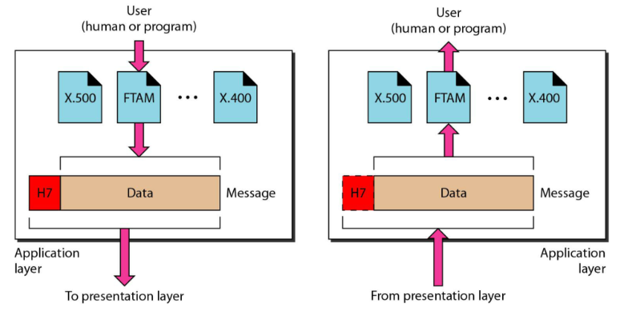

# **网络模型**

[TOC]

## 分层

将复杂系统分解成若干个容易处理的子系统，然后"分而治之"的方法。

分层的层次结构的好处：

1.使每一层实现一种相对独立的功能

2.每一层次的功能相对简单且易于实现和维护

3.分层结构还有利于交流、理解和标准化

### 网络的体系结构(Architecture)

计算机网络各层次结构模型及其协议的集合，称为网络的体系结构(Architecture)。

●体系结构就是这个计算机网络及其部件所应完成的功能的精确定义。

实现(implementation)是遵循这种体系结构的前提下用何种硬件或软件完成这些功能的问题。体系结构是抽象的，而实现则是具体的，是真正在运行的计算机硬件和软件。

计算机网络都采用层次化的体系结构。

计算机网络涉及多个实体间的通信，一般以垂直分层模型来表示

(1)除了在物理媒体上进行的是实通信之外，其余各对等实体间进行的都是虚通信。
	⑵对等层的虚通信必须遵循该层的协议。
	(3)n层的虚通信是通过n/n-1层间接口处n一1层提供的服务以及n-1层的通信(通常也是虚通信)来实现的。

**服务：每一层都使用其直接下层提供的功能**

**分层模型：开发系统互联OSI、TCP/IP模型**

## OSI模型

OSI标准中，采用的是三级抽象:

·体系结构(architecture) ：定义了一个七层模型，用于进行进程间的通信

·服务定义 (service definition) ：层与层之间的抽象接口和交互用的服务原语（server primitive），描述了各层所提供的服务，不涉及接口是如何具体实现的

·协议规范(protocol specification)：精准地定义了应当发送何种控制信息。协议规范说明具有最严格的约束

**注:ISO是组织，OSI是模型。OSI不是一个协议，而是一个模型，其提供了一个用来进行网络系统设计的层次化框架。**

### OSI七层模型

各层之间的互相作用如下：

使用OSI模型的传输过程：

## OSI模型的各个层功能

1.物理层：物理层负责位从一跳（节点）到另一跳（节点）的传递

​	

2.数据链路层：数据链路层将物理层对数据不做任何改动的传输通道变成可靠的链路。

数据链路层负责帧从一跳（节点）到另一跳（节点）的传递

3.网络层：网络层负责将各个分组从源地址传递到目的地址，可能会通过多个网络（链路）

4.传输层：传输层负责一个报文从一个进程到另一个进程的传递

5.会话层：会话层负责对话控制和同步

6.表示层：表示层负责翻译、加密和压缩数据

7.应用层：应用层负责向用户提供服务（To allow access to network resources）

## TCP/IP协议簇

四个层次：

1.主机到网络层

2.互联网层

3.传输层

4.应用层

当TCP/IP与OSI模型进行比较的时候，也可以说他有五层：

物理层、数据链路层、网络层、传输层和应用层

### 寻址

TCP/IP协议簇的应用网络中使用4层地址：物理地址，逻辑地址，端口地址和专用地址

各层与地址的关系如下：

我们将在后续第十三章看到，大多数的局域网使用48位（6个字节）的物理地址，这个物理地址并被写成12个十六进制的数字；每个字节（2个十六进制数用冒号分开），如下面所示：

**07:01:02:01:2C:4B**【6个字节（十二个十六进制）的物理地址】

为了相互连接，每个设备（计算机或路由器）都有一对地址（物理地址和逻辑地址）

如下图所示：

**尽管从跳到跳物理地址会改变，但逻辑地址和端口地址从源地址到目的地址保持不变**

我们将在第23章看到，16位的端口地址是用十进制数所表示，如下所示：

**753**（一个16位端口地址被表示成一个数字）

