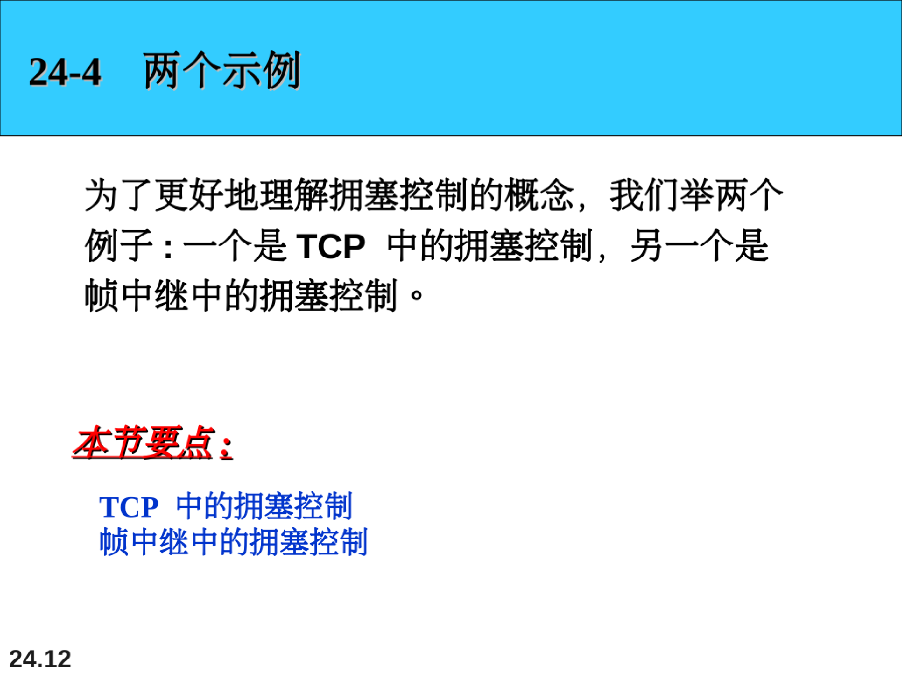
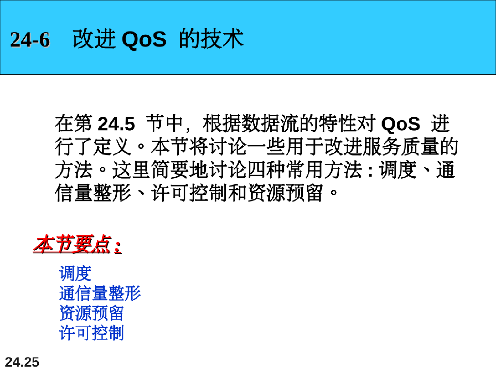
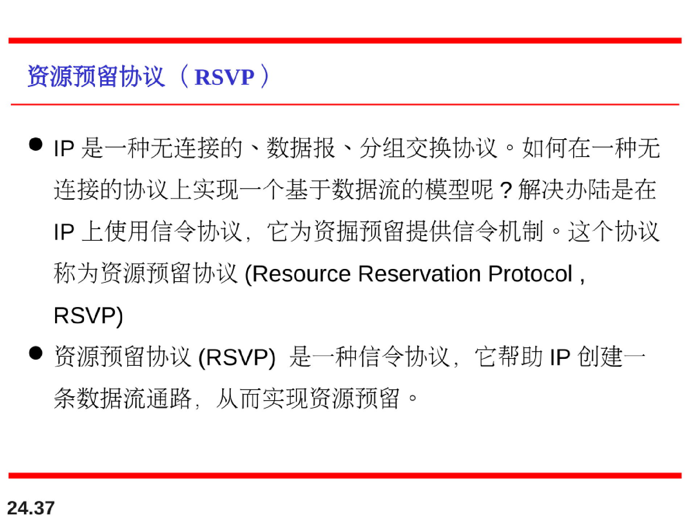
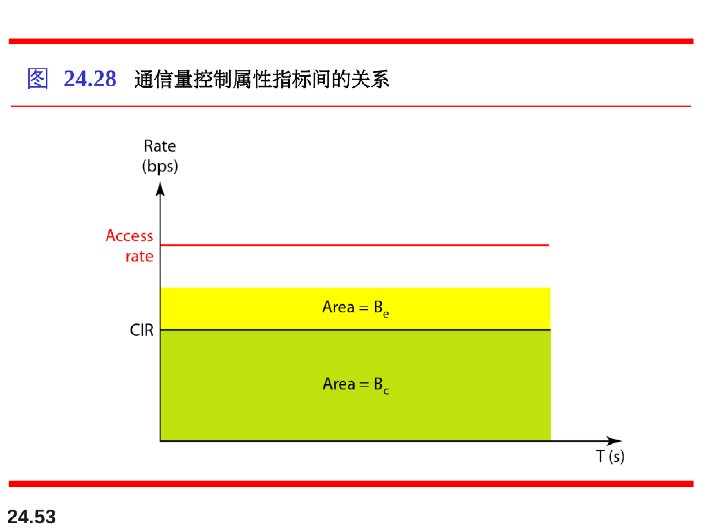

# 拥塞控制和服务质量

## 数据通信量

对拥塞控制和服务质量关注的重要方面是数据通信量。在拥塞控制中，要设法避免通信量拥塞。在服务质量中，要设法为通信量创造合理的环境。因此，在讨论拥塞控制和服务质量之前，首先讨论数据通信量本身。

### 通信量描述符

通信量描述符是描述数据流的定性值。下图用这些值描述了通信量。

## 拥塞（congestion）

拥塞是分组交换网络中的一个重要问题。如果网路中的载荷（load），即发送到网络中的分组数量，超过了网络的容量，即网络中能处理的分组数量，那么在网络中就可能发生拥塞。拥塞控制指的是控制拥塞和使载荷低于网络容量的机制和技术。

## 拥塞控制（Congestion Control）

拥塞控制是指在拥塞发生之前预防拥塞、或在拥塞发生之后消除拥塞的技术和机制。通常，我们把拥塞控制分为两大类：开环拥塞控制（预防）和闭环拥塞控制（消除）。

## 两个示例

### TCP中的拥塞控制

慢启动：

拥塞避免控制：

**TCP拥塞策略总结（重要！！！）：**

## 服务质量（quality of service ， QoS）

服务质量(quality of service , QoS)是一个网络互联问题，对该问题的讨论已经远远超出对它的定义·我们可以非形式地将服务质量定义为数据流所追求的某种目标·

