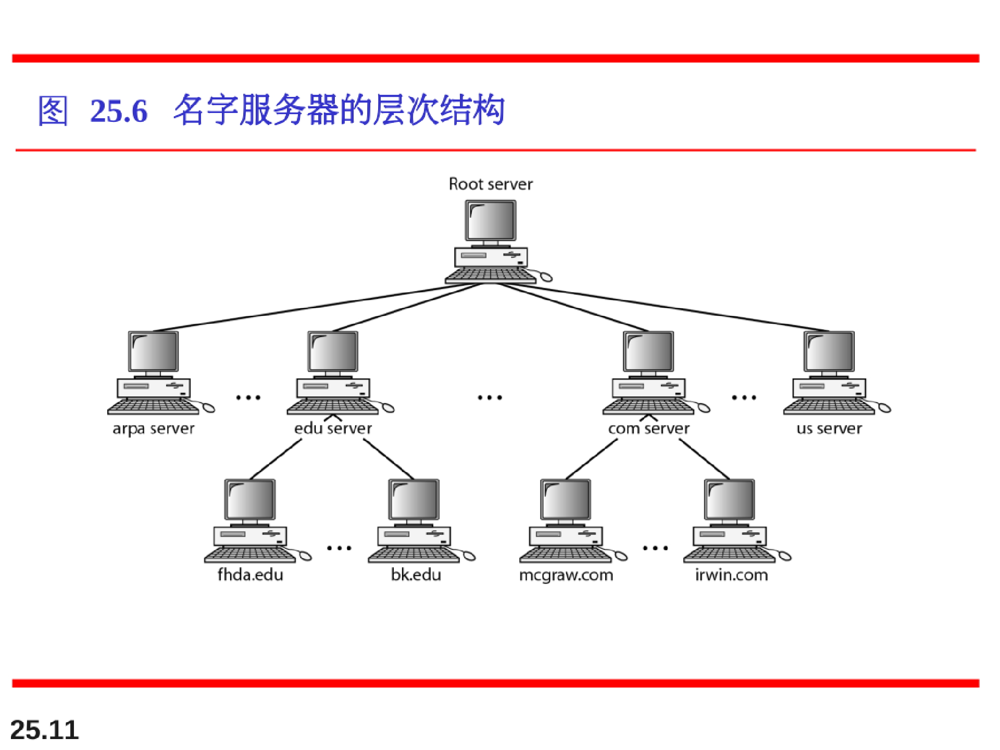
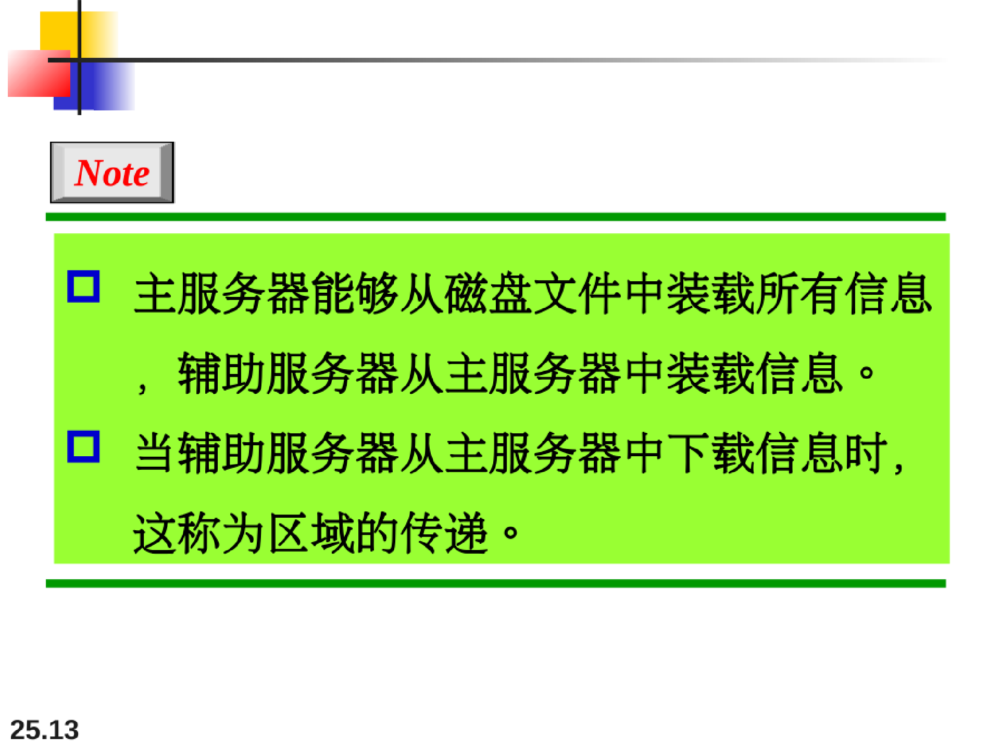

# 域名系统（Domain Name System）

许多应用层软件经常直接使用域名系统 DNS(Domain Name System)，但计算机的用户只是间接而不是直接使用域名系统。

因特网采用层次结构的命名树作为主机的名字，并使用分布式的域名系统DNS 。

名字到域名的解析是由若干个域名服务器程序完成的。域名服务器程序在专设的结点上运行，运行该程序的机器称为域名服务器。

## 名字空间（namespace）

为了实现无二义性，分配给机器的名字必须从名字空间中仔细的选择。该名字空间完全控制对名字和IP地址的绑定。

## 域名空间

为了获得层次结构的名字空间，设计了域名空间。在这种设计方式中，所有的名字由根在顶部的倒置树结构定义。该树最多有128级:0级(根节点)-127级。

## 名字空间的分布

必须将域名空间所包含的信息存储起来。然而只是用一台计算机存储如此大容量的 信息，效率非常低和不安全的。我们讨论名字空间的分布。

根服务器、主服务器和辅助服务器

## 因特网中的DNS

DNS是一种可以在不同平台上使用的协议。在因特网中，域名空间（树）被划分成三个部分：通用域、国家域和反向域。

## 解析

将名字映射成为地址或者将地址映射成为名字的过程，成为名字-地址解析。

## DNS报文

DNS有两种类型的报文：查询和响应。这两种类型的报文具有相同的格式。查询报文由头部和查询记录构成，响应报文由头部、查询记录、响应记录、授权记录和附加记录组成。

### 记录类型

DNS有两种类型的记录，在查询和响应报文的询问部分使用了询问记录；在响应报文中的应答、在授权、附加信息部分使用了资源记录。

