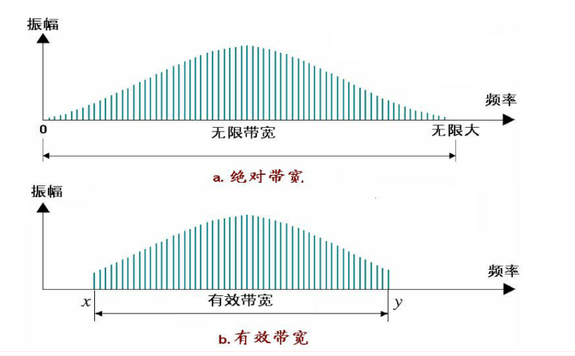

# 数据和信号（物理层）

[TOC]

### **数据要进行传输，必须被转换成电磁信号。(物理传输介质)**

数据可以是模拟的也可以是离散的。模拟数据是连续的,它采用连续值.数字数据有离散状态，它采用离散值.(文本数据、语音数据)

信号可以是模拟的也可以是数字的。模拟信号在某范围内可以有无穷多个取值;而数字信号只能有有限个数值。

周期信号:在一个时间范围内完成一种模式并且在后续的相同时间范围内重复模式。非周期信号:不随时间出现重复的模式。

在数据通信中，通常使用周期模拟信号和非周期数字信号。

周期模拟信号需要更少的带宽，而非周期数字信号可以表示数据的变化.

### 周期模型信号

周期模拟信号可以分为筒单类型或复合类型两种。简单类型模拟信号，即正弦波(sine wave)，不能再分解为更简单的信号。而复合型模拟信号则是由多个正弦波信号组成的。

单个正弦波可用三个参数表示:峰值振幅、频率、相位。

### 用频域图中单个峰值可表示时域图中一个完整正弦波.

## 频谱与带宽Spectrum and Bandwidth

信号的频谱(Spectrum)
信号所包含的频率范围。带宽(Bandwidth)
频谱的宽度(最高频率减最低频率)信号的绝对带宽(Absolute bandwidth)信号的频谱宽度。
信号的带宽(Bandwidth)
信号频谱的某一窄小频带范围集中了信号的绝大部分能量。这一频带称为“有效带宽”或者“带宽”。

请注意:此处指的是信号的带宽

**带宽延迟乘积:定义了能充满链路的位数。**

