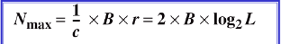

# 数字传输

[TOC]

## 线路编码

**线路编码是将数字数据转换为数字信号的过程**

**数据元素(data element)**:表示一块信息的最小实体，即位(bit)，是被承载的

**信号元素(signal element)**:是数字信号的最小单元，是传输载体

### 比率r的定义

如果一个信号元素承载一个数据元素，则r = 1

如果一个信号元素承载两个数据元素，则r = 2

如果两个信号元素承载一个数据元素，则r = 1/2

如果三个信号元素承载四个数据元素，则r = 4/3

信号元素与数据元素的关系就是如何用信号表示传输的数据，即如何表示0,1

### 数据速率与信号速率 Data rate vs. Signal Rate

**数据速率**：1秒钟发送的数据元素(位)的数量，即bps(bits per second)，或 b/s,也叫比特率

**信号速率**：1秒钟发送的信号元素的数量，单位是波特率(baud)，或者叫做脉冲速率(pulse rate),调制速率(modulation rate)或波特率(baud rate)

目标：增加数据速率而降低信号速率（即增大比率r）

S： 信号元素数量

c:    情形因子(case factor),会根据情形改变

N：数据速率，单位bps

r:    比率

**虽然数字信号的真实带宽是无限的，但有效带宽是有限的。**

是波特率而不是比特率决定了数字信号的带宽

波特率和带宽是有关系的

若给定通道带宽，则可以得到最大数据速率

###### 与奈奎斯特公式对应

假定一般情形 (c = 1/2),则：

### 基线、基线偏移和直流分量

基线(Baseline)：接收方计算收到信号功率的运行平均值。

基线偏移(Baseline Wandering)：0或者1的长字串会引起基线偏移，使得接收方不能正确地进行解码。好的线路编码方案需要防止基线偏移。

直流分量(DC Components)：接近于零的频率成为直流分量。会给不允许通过低频率的系统或使用电子耦合的系统带来问题。

#### 自同步（双方时钟速度不同带来的问题）

自同步(self-synchronization)：接收方的位间隔与发送方的位间隔严格对应与匹配。

数字信号在传输的数据中包含有定时信息。通常是使用信号中包含有提示接收方起始、中间和结束位置的脉冲的跳变(transition)。

## 线路编码方案

### 单极性编码(not-return-zero,NRZ)

不归零是指在为中间信号不会回零。

标准功率，每个单元线路阻抗发送1位所需的功率。

)

Inversion, 反相

在极性NRZ(polar NRZ)编码中，信号有两个电平，常有NRZ-L（NRZ电平编码, NRZ-Level）和 NRZ-I（NRZ反相编码，NRZ-Invert）

**在NRZ-L中，电平决定了位值. **

**在NRZ-I中，电平是否反相决定了位值**

**NRZ-L 和 NRZ-I 都有 N/2 Bd的平均信号速率**

**NRZ-L和NRZ-I都有DC成分问题**：如上一张图可见，带宽中大量功率被集中在了0~N/2的部分，这意味着虽然平均信号速率是N/2，但是能量被平均在这两个值之间的频率了

###  极性归零码(Polar RZ)

在每个位中间信号变为0

信号有三个值：正值，负值和零

缺点：占用的带宽大，三个电平的生成和辨别更加困难

### 双相码(biphase)

#### 曼彻斯特(Manchester)编码

曼彻斯特编码：RZ的位中间跳变 + NRZ-L

位的持续时间被二等分，前半部分电平保持一个水平，后半部分变为另外一个水平

位中间的跳变提供了同步

0：由高低，   1：由低高

#### 差分曼彻斯特(Differential Manchester)编码

差分曼彻斯特编码：RZ + NRZ-I

中间总有跳变，值在位起始位置

0：起始没有跳变； 1：起始有跳变，

**在曼彻斯特编码和差分曼彻斯特编码中，位中间的跳变用于同步，值要么在位中间，要么在位起始位置**

**曼彻斯特编码和差分曼彻斯特编码的最小带宽是NRZ的两倍**

### 双极性(bipolar)

也称为多电平二进制(multilevel binary)编码

一个数据元素的电平是0，另一个数据元素的电平在正值和负值间交替。

在双极性编码中，使用三种电平：正电平，负电平，零

双极性编码的两个例子：

##### AMI(alternate mark inversion信号交替反转码)和伪三元编码(pseudoternary)

**AMI：交替传号反码**

传号表示1    交替1的翻转替换   

 0:  0电平， 1：交替正负电平

**伪三元编码**是AMI的一个变形：1编码成0电平，0编码成正负交替电平

### 多电平编码(multilevel schemes)

通过把m个数据元素的模式编码成n个信号元素的模式，增加每波特的位数。

只有两种数据元素(0,1)，表示m个数据元素组可以产生2^m个数据模式组合。

不同信号元素可以用不同的电平表示，L个不同的电平，可以产生L^n个信号模式组合。

若2^m= L^n，每个数据模式编成一个信号模式

若2^m<L^n，数据模式只能占据一个信号模式的子集

若2^m>L^n，无法数据编码

mBnL，m表示二进制模式的长度

B表示二进制数据

n是信号模式的长度

L是信号的电平数，若L=2，用B替换；若L=3，则用T替换；若L=4，则用Q替换

**在mBnL 方案中, m 个数据元素模式编码成n 信号元素模式， 2m ≤ Ln.**

 Multilevel: 2B1Q scheme：

Multilevel: 8B6T scheme

### （2B1Q、8B6T、MLT-3）（了解）

## 块编码(block coding)

**块编码通常称为mB/nB 编码技术，用 n-bit 位组替换m-bit.**

##### 4B/5B

##### 8B/10B

## 扰码(Scrambling)

!

#### B8ZS(bipolar with 8-zero substitution)

***B8ZS 把8个连续零置换成 000VB0VB.***

#### HDB3(high density bipolar 3-zero)

***HDB3 根据最后一次置换后非零脉冲数把4个连续置换成000V 或 B00V***

## 模拟到数字转换 ANALOG-TO-DIGITAL CONVERSION

### **脉码调制PCM**

**采样、量化等级、量化误差**

#### 采样（Sampling）

**根据Nyquist 定理,采样速率必须至少是信号所含最高频率的2倍.**

#### 量化(Quantization)

采样后的结果是一系列振幅值介于信号最大振幅和最小振幅间的脉冲。

量化等级(Quantization levels), L 

量化误差(Quantization errors)

量化是一个近似过程，输出值与实际输入值之间差值

可以证明量化误差对信号SNRdB的影响取决于量化级别L或每个样本位数nb.

#### PCM

均匀量化： △的高度是固定的

非均匀量化：也就是△的高度不是固定的，低振幅时△较大，而接近高振幅时△较小；

编码：采样后的数据用多少位比特表示，每个样本可以转换成nb个位的码字

#### PCM带宽

## Delta调制

PCM技术复杂性很高，采用delta调制减少其复杂性；

delta是正的就记录为1，如果是负的就记录为0。

## 传输模式(TRANSMISSION MODES)

 通过链路传输二进制数据可以采用并行模式或者串行模式。

在并行模式中，每个时钟脉冲发送多个位。

在串行模式中，每个时钟脉冲发送1位。

并行传输只有一种方式，

串行传输则分为三类：异步(asynchronous)同步(synchronous)等时(isynchronous)

### 并行传输(parallel transmission)

### 串行Serial transmission

#### 异步传输

在传输中信号的时序并不重要，信息的接收和转换通过约定的模式进行。

约定模式基于将位流组成字节的方式建立，作为一个单位沿着链路传输。

没有同步时钟，增加起始位和停止位。

**异步在这里是指在字节级上的异步，但是每位仍然要同步，它们的持续时间是相同的。**

#### 同步传输

同步传输的优点是速度快

同步传输通常多用于传输大块二进制数据。

#### 等时(isochronous)

保证数据以固定速率到达

在实时音频和视频中，帧间的不等延迟是不可接受的

整个流必须同步。