# 模拟传输（Analog Transmission）

[TOC]

## Digital-to-analog conversion数字到模拟转换

将数字数据转换为带通模拟信号传统上称为数字到模拟转换。

将低通模拟信号转换为带通信号传统上称为模拟到模拟转换。

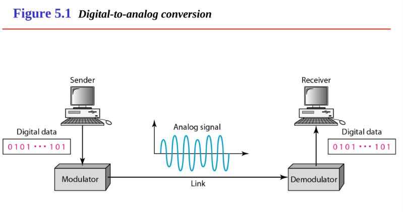

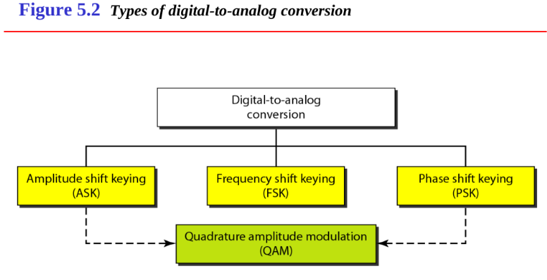

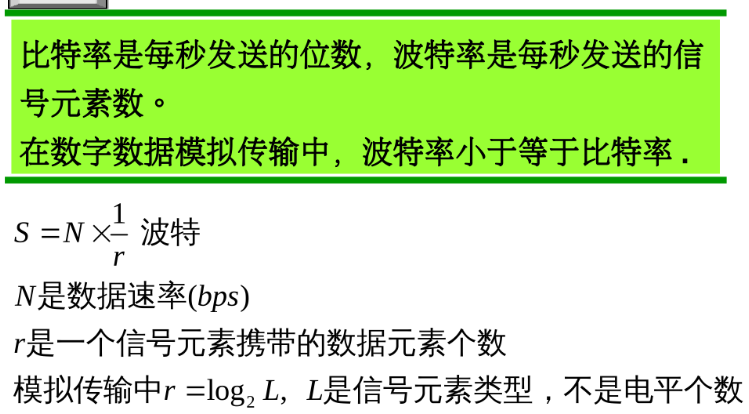

## 幅移键控（ASK）

### 二进制ASK

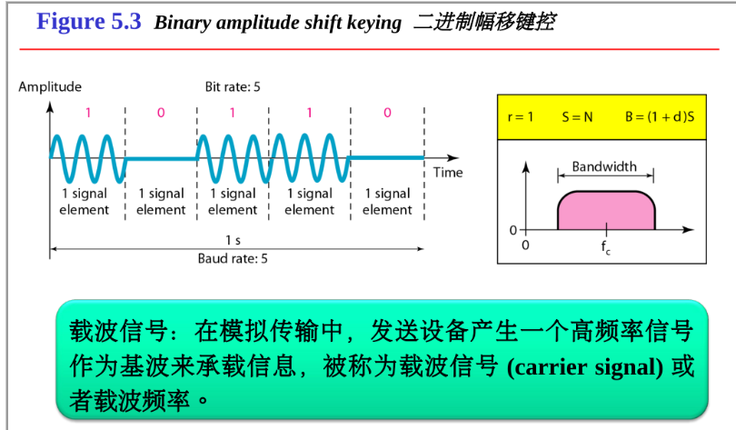

此处，fc即为载波信号的频率

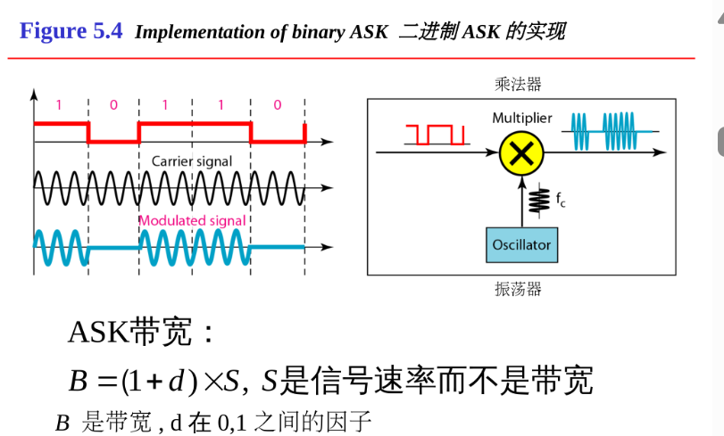

## 频移键控（FSK）

### 二进制FSK

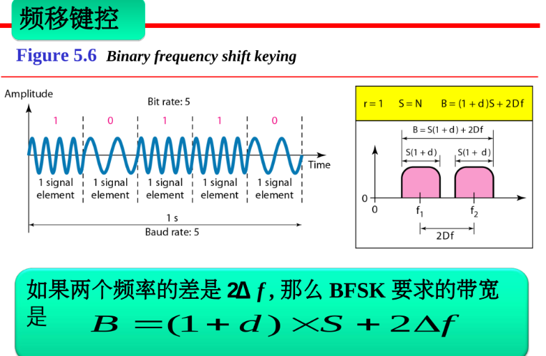

-

### 多电平FSK

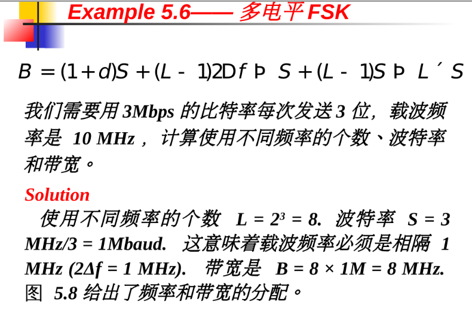

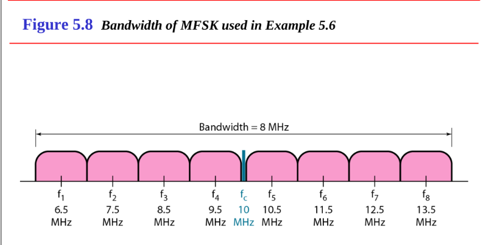

## 相移键控（PSK）

### 二进制PSK

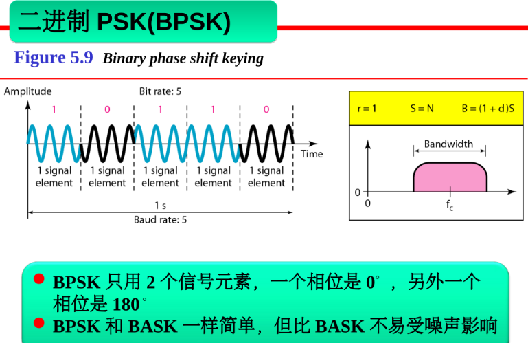

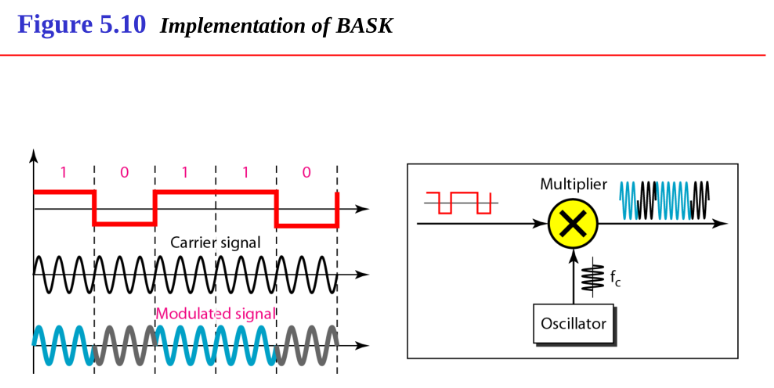

### 正交PSK（QPSK）

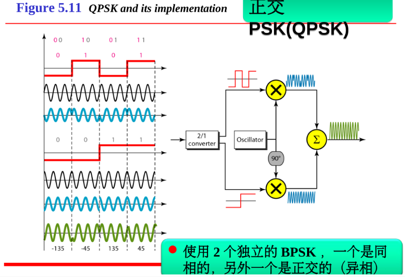

## 星座图

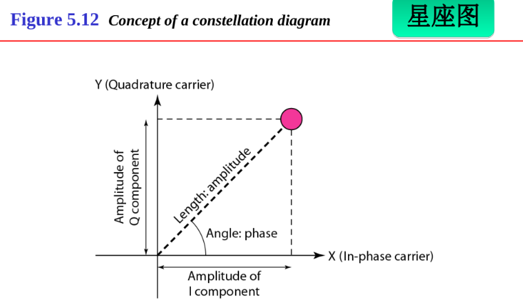

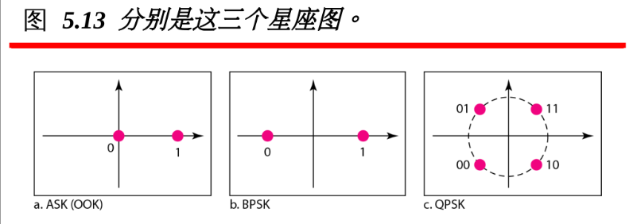

y轴为正交成分的峰值振幅

x轴位同相成分的峰值振幅

距离远点的距离为整个信号的峰值振幅

与x轴正方向的夹角为该信号元素的相位

## 正交振幅调制（QAMs）

### 正交振幅调制是ASK和PSK的结合

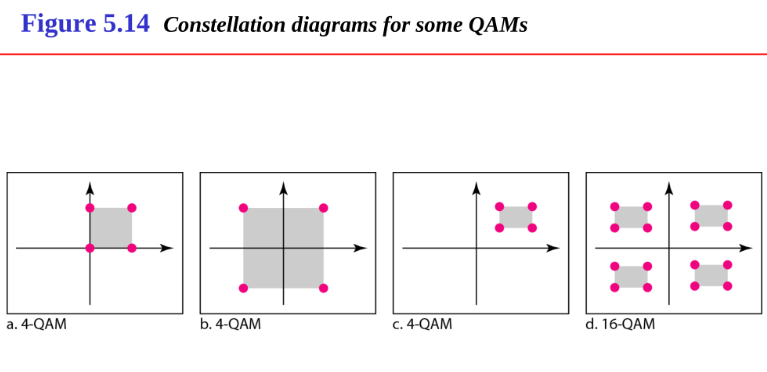

## 模拟信号调制（analog and digital）

如果传输介质具有带通特性或者只有带通带宽可用，则模拟信号就需要调制

即与一个载波相合并

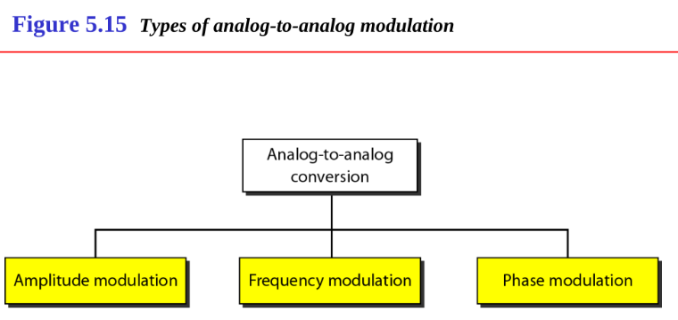

### 调幅（AM）

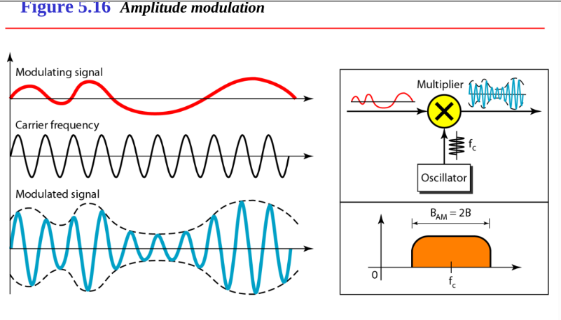

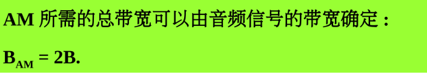

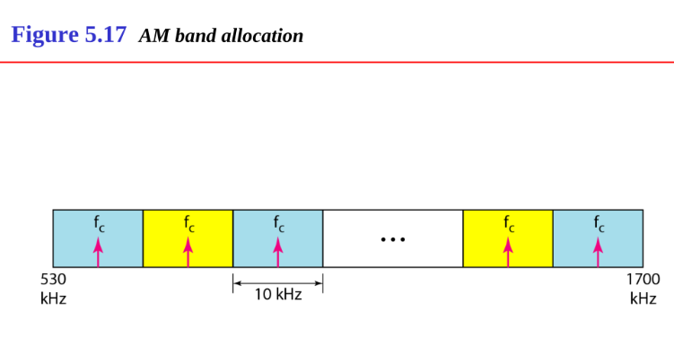

### 调频（FM）

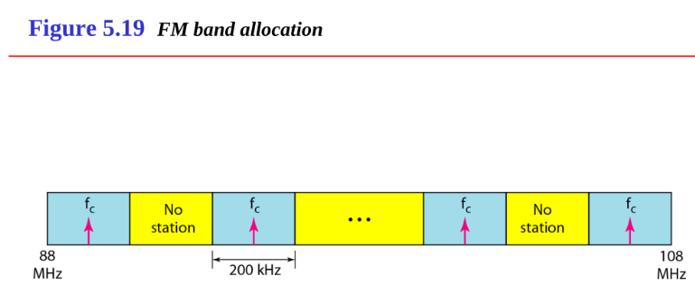

### 调相（PM）

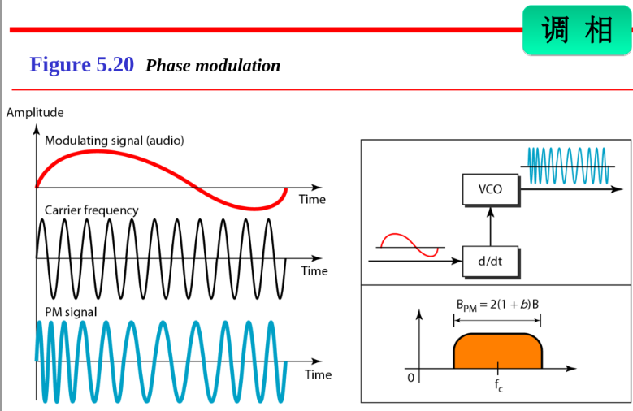

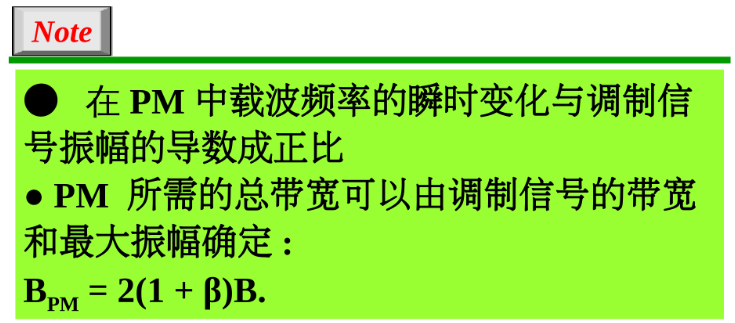

PM即将调制信号的振幅的导数与载波信号相合并，而FM是直接将调制信号与载波信号相合并