# 传输介质

传输介质与物理层：

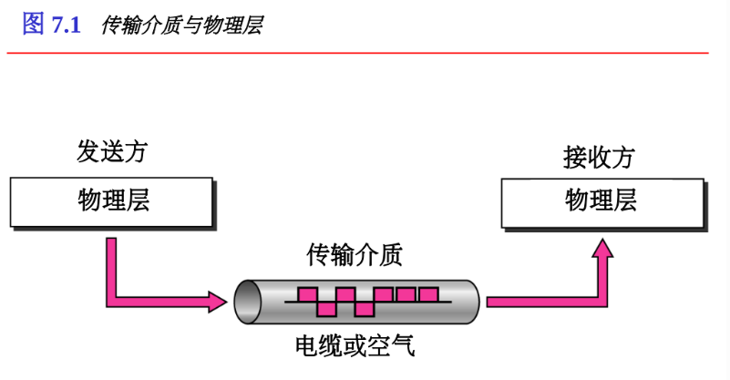

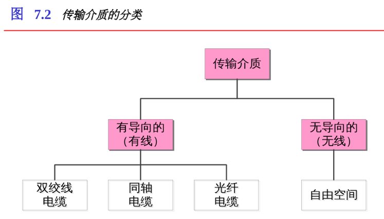

## 有向介质

有向介质是指那些在设备之间提供通路的介质，包括双绞线、同轴电缆和光缆

### 双绞线（UTP连接）

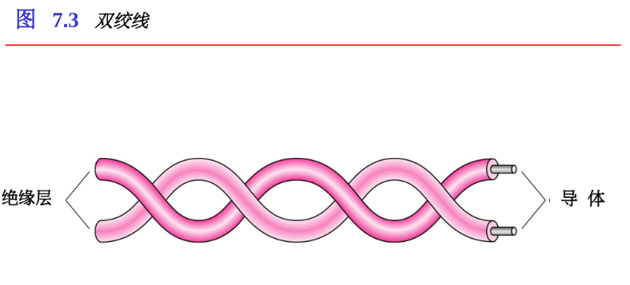

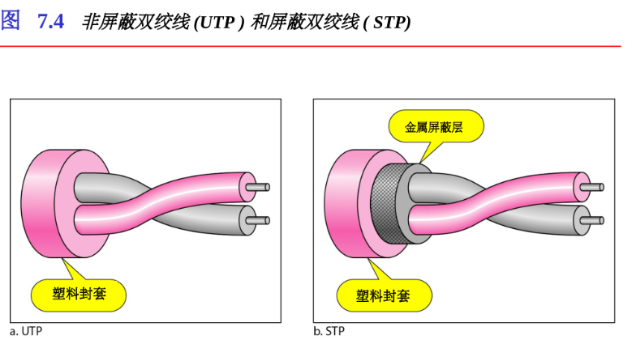

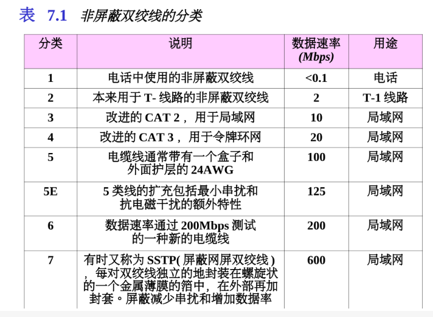

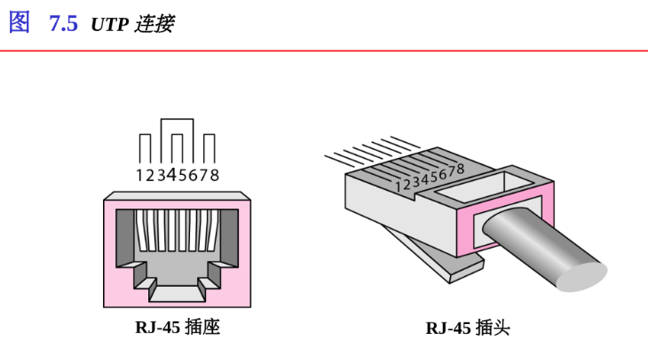

### 同轴电缆（BNC连接器）

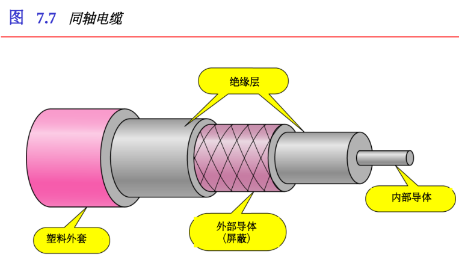

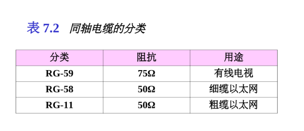

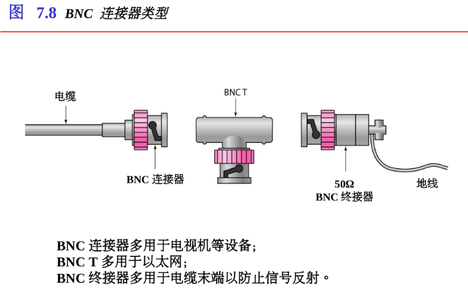

### 光纤

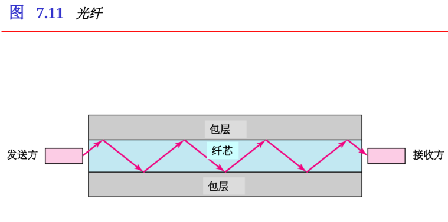

#### 光纤的传播模式

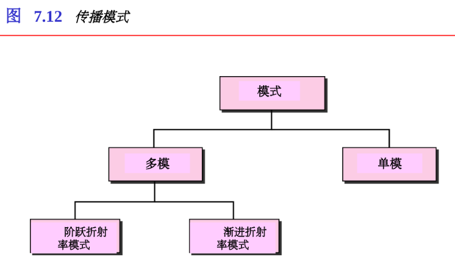

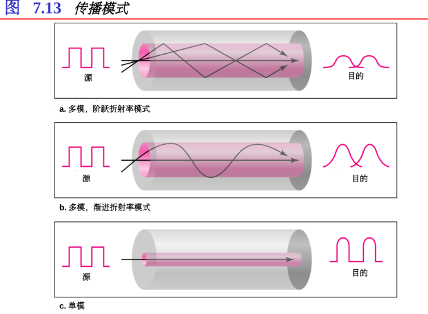

## 无向介质：无线

无向介质不使用物理导体传播电磁波。

这种类型的通信通常是指无线通信。

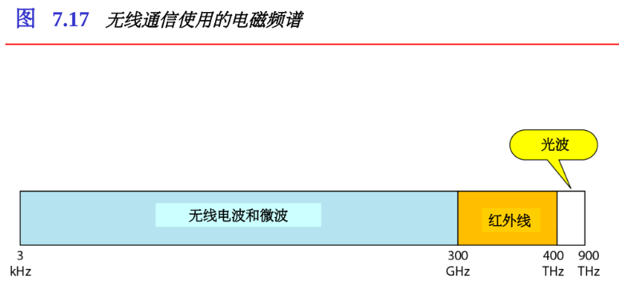

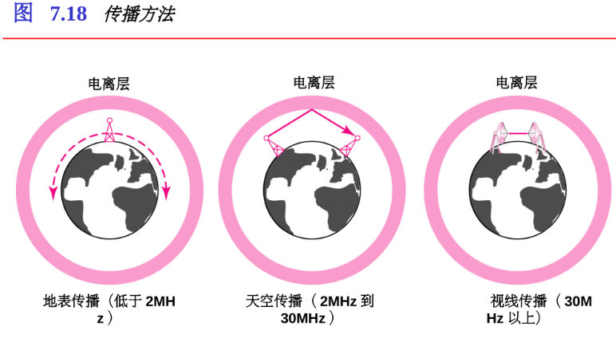

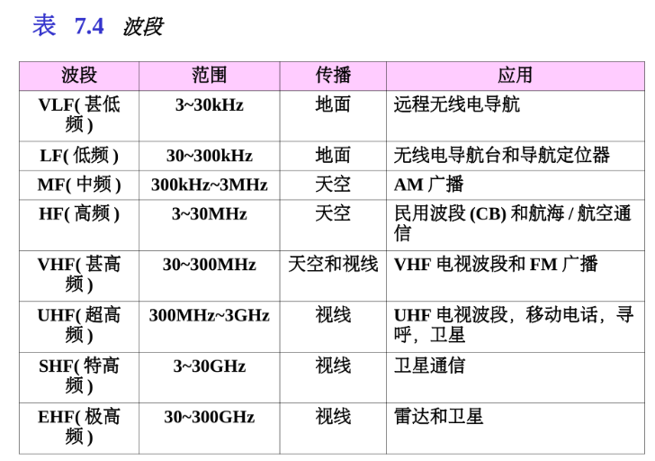

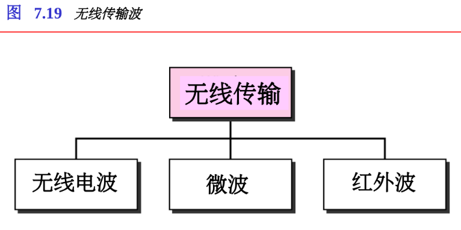

无线电波用于多播通信，如收音机、电视以及寻呼系统。

微波用于单播通信，如移动电话、卫星网络和无线局域网。

红外信号可以在封闭区域用于短距离通信，使用视线传播。

