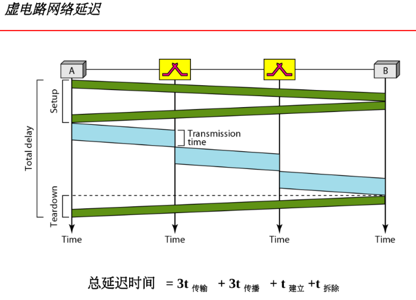
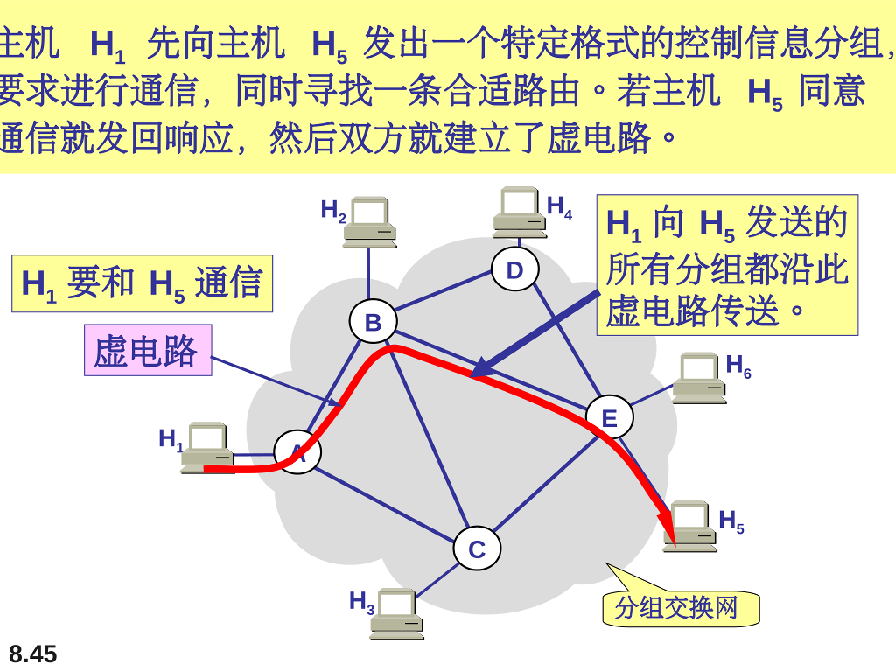
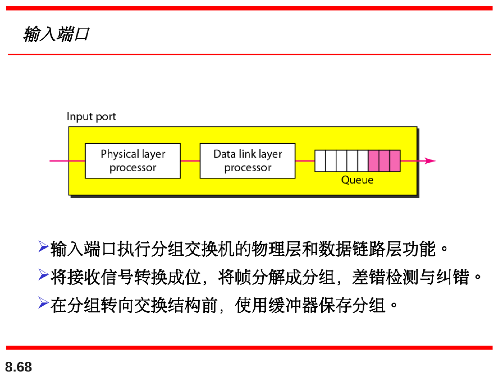

# 交换

交换网络：由一系列互联的节点（交换机）构成，能够在链接到交换机的设备之间建立临时连接。

## 电路交换网络

三个阶段：

1. 建立阶段（setup phase）
2. 数据传输（data transfer）
3. 拆除阶段（teardown phase）

电路交换必须预留资源：

在传统电话网的物理层采用电路交换方法。

常使用7号信令系统（SS7）建立连接盒撤销连接。

## 数据报网络

在分组交换网中，不存在资源预留，资源按需分配。

****

（后续会有相关静态路由与动态路由RIP相关等路由表建立方式）

假设数据报网传输过程中经过3跳情况下的延迟计算：

**因特网**在**网络层**用数据报方法对分组进行交换。

## 虚电路网络

注意：虚电路网络通常在数据链路层实现，电路交换网在物理层实现，数据报网络在网络层实现

虚电路的数据报中不包含端到端的地址信息，只包含当前虚电路标识符，然后根据交换机中建立阶段生成的虚电路标识符交换表前往下一条并更新数据报中的虚电路标识符VCI

在交换**广域网**中，**数据链路层**通常采用虚电路技术实现

## 广域网

注意：数据报交换无连接，虚电路交互有连接（即建立连接的过程）

### 数据报服务是不可靠的服务：

可靠通信由软件实现（TCP）

#### 虚电路服务相对拥有较好的服务质量（QoS）：

让网络只提供数据报服务可以大大简化网络层的结构。

并且因特网的发展也充分说明了在网络层提供数据报服务是非常成功的。（迅速且经济）

此外，数据报服务还很适合用于多播与广播

## 交换机结构

