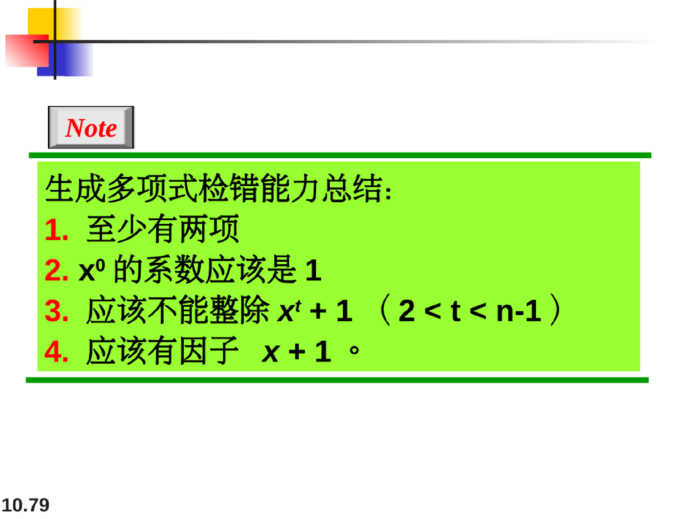
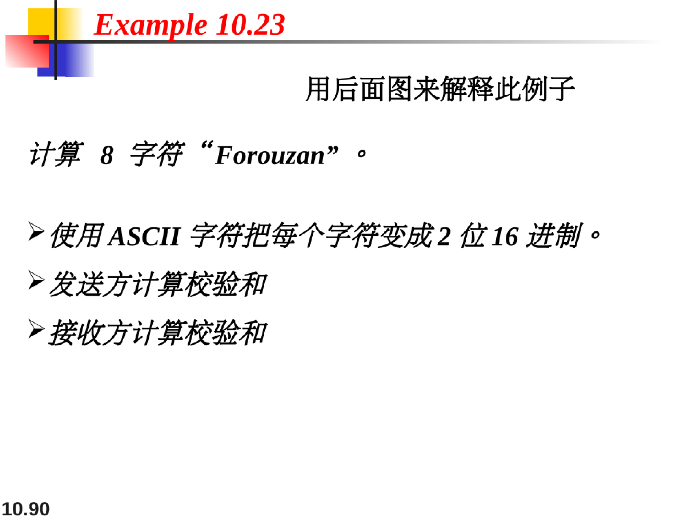

# 检错与纠错（error detection and correction）

数据在传输的过程中可能遭到破坏，一些应用需要进行检错和纠错。

## 差错类型

### 单比特差错

在单比特差错中，数据单位中仅有一比特发生变化。

### 突发差错性差错

一个突发差错意味着数据单元中两位或多位发生变化。

为了检测或纠正错误，我们需要发送除了数据外的额外（冗余位）

## 块编码

在模n运算中，只使用0到n-1的整数

n = k+r

### 检错码

第四章的4B/5B码就是这种编码的一个好例子。

一个k=2,n=3的差错编码例子：

检错码是为某些类型的差错设计的，只能检测这些类型的差错；

其他类型的差错就无法检测到

### 纠错码

k=2, n = 5的纠错码例子：

### 汉明距离

两个字的汉明距离是对应位不同的数量

### 最小汉明距离

最小汉明距离是一组字中所有可能对的最小汉明距离

求解示例：（10.2例子的）

**检错码所需最小汉明距离：**

如一个编码方案的最小汉明距离为2，则只能检测单比特错误

**纠错码所需最小汉明距离：**

如最小汉明距离为3的编码方案能最多纠错一位的差错

综合示例：

## 线性块码（liner block codes）

示例：

**在线性块码中的简便最小汉明距离计算方式：**

## 奇偶校验码

### 简单奇偶校验码

比如：C（5,4）是每四位数据字补上一位冗余位，使得这五位里面1的个数为偶数

奇偶校验码只能检测出奇数个错误，不能检测出偶数个错误。

不仅仅能保证检测出一个单比特差错以外，还能发现任意奇数个差错。

### 两维奇偶校验码

## 汉明码

用发送过来的数据字对应的冗余位和发送过来的冗余位做模2运算得到校正子

然后根据下表来使用校正子进行纠错：（b3b2b1b0q2q1q0）

重要的计算例子：

## CRC循环码（cyclic codes）

**循环码**是有一个附加性质的特殊的线性块码。这个性质是如果码字循环移位（旋转)﹐结果还是另一个循环码字。

需要预先在发送方和接收方有约定好的生成子

## 校验和与反码

